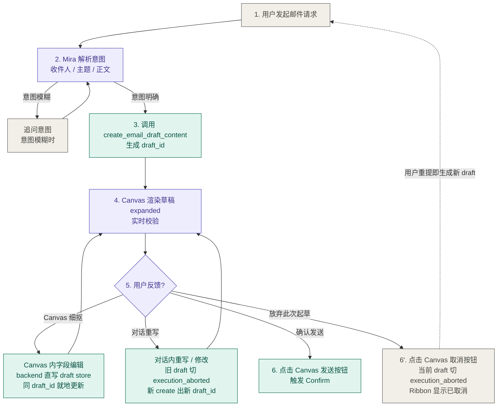
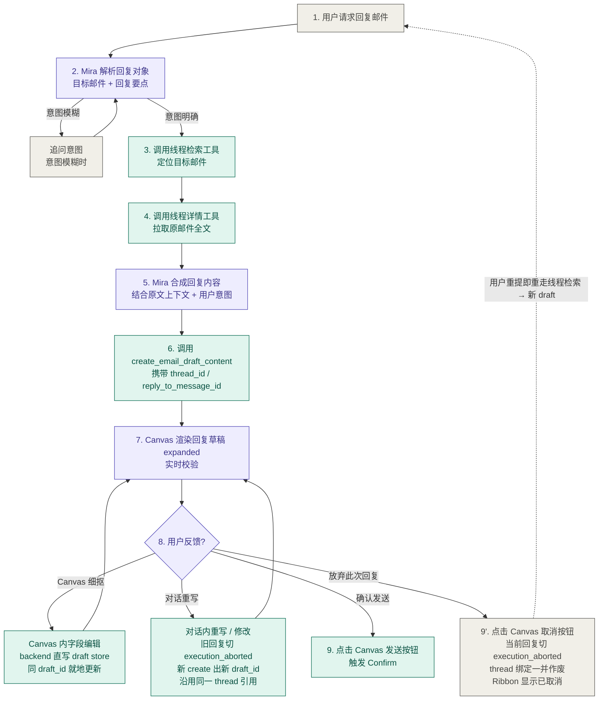

# PRD：Mira Outreach Email Canvas V3

> 对外版本 / External Version
>
> 负责人：Jacinta Gu
> 作者：产品专家 Agent（claude-sonnet-4-6）
> 创建日期：2026-05-10（V1.0 起）/ 2026-05-18（V2.0 修订）/ 2026-05-19（V3.0 修订）
> 目标上线：TBD
> 版本：V3.0

---

## 基本信息

| 字段 | 值 |
|------|-----|
| feature_name | Mira Outreach Email Canvas V3 |
| feature_type | feature |
| owner | Jacinta Gu |
| author | 产品专家 Agent（claude-sonnet-4-6） |
| created_date | 2026-05-10 |
| last_updated | 2026-05-19 |
| target_launch | TBD |
| version | V3.0 |

## 变更记录

| version | section | change | reason | date | author |
|---|---|---|---|---|---|
| V1.0 | 全部 | 初始版本 | Email Canvas V1 立项 | 2026-05-10 | 产品专家 Agent |
| V2.0 | REQ-0 / §工具定义 / REQ-1~2 交互步骤 / Anti-Scope | 工具链路对齐 Email Connect V0.1.0：新增 REQ-0 承载 Mira Host 内置 create / update 工具；草稿走 Mira 自有存储（不调 CREATE_DRAFT 类 Composio action）；发送统一走 send 类 Composio action + Host HITL `global_confirm`；Confirm 失败不降级 | V1.0 抽象工具名与真实 Composio 工具池脱节；Confirm 降级会架空二次确认 | 2026-05-18 | 产品专家 Agent |
| V3.0 | REQ-3 / REQ-4 / §工具定义 / 流程图 / 设计原则 / 数据指标 / 术语表 | ① 删除 REQ-3「邮件正文复制」；操作区改为发送 + 取消，取消语义对齐 capability config `execution_aborted` 终态；② 去掉 `update_email_draft_content` 工具——对话改 = 调 create 新建 draft + Host 自动切旧 draft 终态；Canvas UI 改 = backend 直写就地更新；REQ-4 由「双向同步」改名为「Canvas state 持久化与会话恢复」；③ `create_email_draft_content` description 增补 when / when-not 边界（强约束：未连邮箱不调用），output 新增 `connector` 对象供 Canvas 渲染 header；④ 同步更新 `email-canvas-capability-config.md` 至 v1.2 | ① 复制正文不在 V3 范围；② 对话改与 Canvas 改职责分离，避免 LLM 在 create / update 间判断、消除同 draft 并发写；③ 工具 description 必须直接表达边界，避免 LLM 在无 connector / 意图模糊 / UI 细抠 / 单纯发送等场景误触发 | 2026-05-19 | 产品专家 Agent |

---

## 概述

### 一句话摘要

猎头、TA、HR 通过 Mira 发起 Outreach 邮件时，对话流无法承载收件人/主题/正文等结构化字段，也无法在发送前完成就地校验，导致用户必须使用 chat 来进行优化发送内容，破坏 Agent First 体验。Email Canvas V2 在 Mira 对话旁引入 Canvas（画布）UI 容器，让用户能在对话中完成邮件起草、实时编辑和发送的完整流程。V2 支持起草新邮件和起草邮件回复两类主流程，工具调用链路对齐 Mira × Email Connect V0.1.0 的真实 Composio action（草稿是 Mira 内部 Canvas state，发送通过写类 Composio action + Mira Host HITL global_confirm），目标是将 Outreach 触达链路在 Mira 内形成可验证的完整闭环。

### 背景

- 业务背景：Mira Outreach 的使命是让猎头能在 Mira 内完成从候选人搜索到触达的全流程。Email 是 Outreach 触达的核心执行产物，发送给候选人的邮件需要收件人、主题、正文三个结构化字段，以及抄送、密送等可选字段。
- 当前现状：Mira × Email Connect V0.1.0 已提供草稿创建、草稿更新、线程检索、草稿发送等底层操作能力，但没有专属的 UI 容器承载邮件字段——用户在对话中只能看到纯文本摘要，无法就地编辑和校验。
- 关键痛点：对话气泡无法展示邮件的结构化字段，用户看不清收件人列表和格式是否正确，发送前缺乏逐字段校验，出错后只能在邮箱客户端修改。
- 核心问题：Mira 的邮件发送能力在底层已存在，但缺少 UI 容器层把能力对用户"显现出来"，导致 Outreach 触达闭环在 Mira 内断开。

### 目标

> 定量指标不在此处展开，统一由 成功指标 承载。

- 在 Mira 对话旁提供 Email Canvas UI 容器，让用户能在对话流中完成邮件起草和发送的完整操作，无需切换到外部邮箱客户端
- 对话和 Canvas 两条修改路径职责分离：对话驱动的"重写式"修改 → 新建 draft（旧 draft 切终态、新卡替代旧卡 ribbon）；Canvas UI 内的字段级编辑 → 当前 draft 就地更新；Mira 后续应答始终基于最新 state
- Canvas 通过前端结构性校验（必填字段、格式、业务规则）在用户点击发送前兜底，减少无效发送

### 核心假设

1. **Email Connect V0.1.0 的底层工具在 V2 交付时保持稳定**
   验证：检查 Email Connect V0.1.0 是否处于 finalized 状态。若不成立：Canvas V2 工具调用可能失败，需要与 Email Connect 版本联动更新。

2. **[假设] 用户在 Mira 对话中发起邮件请求时有明确的收件人意图（知道要发给谁）**
   验证：种子用户使用数据观察对话发起邮件时的意图完整率。若不成立：需要加强对话中的收件人引导流程，V2 Canvas 结构校验不能替代意图补全。

3. **[假设] Gmail 和 Outlook 是 V2 目标用户的主要邮箱服务商**
   验证：Email Connect V0.1.0 已覆盖 Gmail + Outlook（Composio 接入），与目标用户使用场景吻合。若不成立：需扩展支持其他邮箱服务商，超出 V2 范围。

4. **[假设] 对话→新建 draft / Canvas→就地更新的双路径模型在 V3 范围内可落地**
   验证：工程团队评估 Mira Host 自动切旧 draft 终态的能力 + Canvas UI 直写 backend 的延迟与一致性。若不成立：[需 CTO 评估] 是否退化为仅 Canvas UI 编辑、对话只能创建首封不可修改。

### 不做的事（Anti-Scope）

| item | exclusion_reason |
|------|------------------|
| 附件上传 | V2 聚焦文字邮件发送核心流程；附件涉及文件大小限制、格式校验、存储方案等额外复杂度，推入 Phase 1+ |
| 多版本草稿管理 | 版本管理引入额外状态复杂度；LLM 可自主判断是否创建新草稿，V2 不强制版本切换 UI |
| 批量群发与多实例 Canvas（Outreach Sequence 定制化批量 / Canvas Tab 并行 / 草稿列表切换） | V2 的多 draft 场景采用顺序起草模式（一次一个活跃 Canvas，LLM 对话层驱动切换）；每个收件人独立定制内容的批量工作流属于 Outreach Sequence，超出 V2；Canvas 多实例 UI 超出 V2 范围 |
| Composio 服务端 draft 持久化（GMAIL_CREATE_EMAIL_DRAFT / OUTLOOK_CREATE_DRAFT 调用） | Canvas V2 的草稿是 Mira 内部 state（Canvas Framework v5 §8.5 持久化分层：前端内存 → localStorage → 服务端 cache 5min TTL Redis → 数据库），不在用户 Gmail / Outlook 草稿箱出现；CREATE_DRAFT 类 Composio action 即使存在于 Email Connect V0.1.0 工具清单也不被本场景调用。"草稿暂存到原生邮箱客户端继续编辑"作为独立 P2 能力 |
| LLM 自主调用 send 类工具且绕过用户确认 | send 类工具（GMAIL_SEND_EMAIL / OUTLOOK_SEND_EMAIL / GMAIL_REPLY_TO_THREAD / OUTLOOK_SEND_DRAFT）保留在 LLM 工具池以维持 agent 心智，但调用语义被重定义为"请求发送"——任何 send 类工具调用都强制触发 Mira Host `hitl_hook=global_confirm`，真实发送在用户 approve 后才执行 |

---

## 功能需求

### 流程图

#### 流程 1：起草新邮件



#### 流程 2：起草邮件回复



### 功能范围

| id | feature | priority | description | acceptance_criteria |
|---|---|---|---|---|
| REQ-0 | Mira Host 内置邮件草稿创建工具 | P0 | Mira Host 提供 `create_email_draft_content` 内置工具，承载 Email Canvas 的草稿创建；不调用任何 Composio MCP action，不在用户 Gmail / Outlook 草稿箱产生 draft 对象；为 REQ-1 / REQ-2 提供基础能力支撑。对话驱动的字段修改也走 create（旧 draft 切 `execution_aborted` 终态、生成新 draft_id 的新 draft）；Canvas UI 内的字段编辑由 Mira backend 直接写入当前 draft store，不走 LLM 工具 | `create_email_draft_content` 的 input_schema / output 语义按 §工具定义 落地，且与 Composio 完全隔离 |
| REQ-1 | 起草新邮件 | P0 | 用户在对话中发出邮件请求，Mira 解析意图后创建邮件草稿并在 Canvas 渲染，用户可在 Canvas 就地编辑、校验后发送 | Given 用户请求发送邮件且三必填字段完整，When 点击 Canvas 发送按钮 → Confirm → 确认，Then 邮件成功发出且 Canvas 进入只读状态并以 Inline collapsed 展示 |
| REQ-2 | 起草邮件回复 | P0 | 用户在对话中请求回复某封邮件，Mira 检索线程、拉取原文、合成回复后在 Canvas 渲染，用户可编辑后发送 | Given 用户请求回复且目标线程已定位，When 点击 Canvas 发送按钮 → Confirm → 确认，Then 回复邮件成功发出且 Canvas 进入只读状态并以 Inline collapsed 展示 |
| REQ-4 | Canvas state 持久化与会话恢复 | P0 | Canvas UI 字段编辑实时持久化到 draft store（同一 `draft_id` 就地更新）；会话切换 / 跨设备 / 网络断开后 Canvas 按 `draft_id` 自动恢复最近状态。对话驱动的修改不在此 REQ 范围（走 REQ-1 / REQ-2 的新建 draft 路径） | Given 用户在 Canvas Subject 字段输入新文本并离开字段，When Mira 下一轮响应基于最新 state，Then 主题为用户编辑后的内容；Given 用户切走会话再切回，Then Canvas 按 draft_id 自动重新挂载到最近状态 |
| REQ-5 | Canvas 容器校验与发送条件 | P1 | Canvas 对收件人、主题、正文进行结构性校验；三字段任一缺失则发送按钮置灰；收件人格式错误在失焦时标红；重复收件人在发送时静默去重；发送中按钮禁用；已发送后 Canvas 只读 | Given 主题字段为空，When 用户点击发送区域，Then 发送按钮保持置灰状态且主题字段标红提示 |
| REQ-6 | 发送前二次确认 | P0 | 用户点击 Canvas 发送按钮后，Mira 调用 Confirm 工具弹出预览 panel，列出收件人/主题/正文截断 + 风险提示；用户必须二选一「拒绝 / 确认」，确认后才真正发送 | Given Canvas 草稿通过容器校验，When 用户点击发送按钮，Then Mira 弹出 Confirm panel 等待用户确认 |

---

### 需求详述

> **V2 工具命名约定**：以下需求详述与 AC 表中出现的工具名约定如下：
> - `send_email`（小写）= **PRD 行文伞名，不是真实工具**；代指 LLM 工具池中的任一写类 Composio action（`GMAIL_SEND_EMAIL` / `OUTLOOK_SEND_EMAIL` / `GMAIL_REPLY_TO_THREAD` / `OUTLOOK_SEND_DRAFT`），由 LLM 根据用户绑定邮箱 connector + 场景（新邮件 / 回复）自行选择具体 action；LLM 工具池中**没有**名为 send_email 的工具——与 `create_email_draft_content`（真实的 Mira Host 内置工具，V3 唯一引入的 LLM 草稿工具）有本质区别
> - `create_email_draft_content` = **Mira Host 内置工具**（与 `write_todo` / `Confirm` 同框架），用于 Canvas state 的创建（含对话驱动的修改 = 新建 draft + 自动切旧 draft 终态）；handler 是 Mira 后端代码，不走 MCP 协议、不调 Composio；调用本工具**不会**在用户 Gmail / Outlook 草稿箱产生 draft 对象。V3 不提供 update 工具，Canvas UI 字段编辑走 backend 直写路径，不经 LLM
> - 大写工具名（如 `GMAIL_SEND_EMAIL` / `OUTLOOK_CREATE_DRAFT_REPLY`）= **Composio 真实 action 名**，详细 inputSchema 见 Email Connect V0.1.0 PRD
> - 详细分组与调用语义见 §工具定义

#### REQ-0：Mira Host 内置邮件草稿创建工具

**用户故事**：作为 LLM Agent，当我在对话中识别到用户起草 / 回复 / 修改邮件意图时，我需要调用 Mira Host 内置的草稿创建工具生成新 draft，以便 Canvas UI 实时渲染；对话内的任何修改意图均通过新建 draft 体现（旧 draft 切终态），不在 Canvas state 上做就地 patch，同时不污染用户的原生邮箱草稿箱。

**前置条件**：
- Mira Host HITL / Canvas state 系列工具已注册到 LLM 工具池
- 用户已绑定至少一个邮箱 connector（Gmail 或 Outlook）

**核心契约**：见 §工具定义（`create_email_draft_content` 的 input_schema / output）。本 REQ 不重复 schema，仅约定**交付边界**与**功能性 AC**。

**交付边界**：
- 工具注册到 LLM 工具池（与 `write_todo` / `Confirm` 同框架），LLM 可见可调
- handler 是 Mira 后端代码，不调任何 Composio MCP action
- 前置：用户必须已连接至少一个 connector；未连接时工具层返回 `no_connector_authorized` 错误（与 schema validation error 并列的拒绝路径），draft 不创建；LLM 端应在调用前通过注入的 user-connector 上下文判断，不应在无 connector 时调用
- 输入字段格式校验（邮箱格式 / Subject 100 字符 / 数组上限 50）在工具层执行，失败返回 schema validation error
- 每次调用生成新的 `draft_id`，不复用已存在 draft；上一封活跃 draft 由 Mira Host 自动切 `execution_aborted` 终态（对应 capability config B.2 第 4 态 `已取消`）
- output 返回 `connector` 对象（name + logo），由 backend 解析；Canvas inline card header 的 icon / type_label 直接消费
- Canvas UI 内的字段编辑由 Mira backend 直接写入当前 draft store（同一 `draft_id`），与本工具不冲突——本工具仅对应"对话驱动 / 重写式"修改

**验收标准**

| AC ID | 类型 | Given | When | Then | test_type |
|-------|------|-------|------|------|-----------|
| AC-0.1 | happy | LLM 工具池已加载 Mira Host 内置工具 | LLM 调 `create_email_draft_content` 传入 `{ to: ["a@b.com"], subject: "X", body: "Y" }` | 返回 `{ draft_id, state }`，state 含传入的三字段；Canvas 接收到 entityRef 事件并渲染 | integration |
| AC-0.2 | happy | 已存在活跃 draft_id=d1（pending 态） | LLM 再次调 `create_email_draft_content` 传入 `{ to: [...], subject: "新主题", body: "新正文" }`（对应用户在对话中要求修改） | 返回 `{ draft_id: d2, state }`（d2 ≠ d1）；d1 自动切到 `execution_aborted` 终态；Canvas 把 d1 折叠为 Inline ribbon 显示「已取消」，并渲染 d2 expanded 卡片 | integration |
| AC-0.3 | 边界 | 字段 to 含非法邮箱 "abc@" | LLM 调 create 传入该字段 | 工具返回 schema validation error；draft 不创建；上一封活跃 draft 不受影响（不切终态）| unit |
| AC-0.4 | 边界 | 字段 subject 长度=101 | LLM 调 create | 工具返回 schema validation error；draft 不创建 | unit |
| AC-0.5 | 跨模块 | LLM 主动调 `create_email_draft_content` + 同会话内监控 Composio 调用 | 调用完成 | Composio MCP 工具池调用计数 = 0；用户 Gmail / Outlook 草稿箱不出现新 draft（人工核查或邮箱 API 查询）| integration |
| AC-0.6 | 跨模块 | draft_id=d1 已渲染到 Canvas，pending 态 | Canvas UI 在 To 字段输入额外收件人 | Canvas UI 通过 Mira backend 直接写入 d1（同一 draft_id），不触发新 create；d1 保持 pending；下一轮 Mira 对话基于最新 d1 state 响应 | e2e |
| AC-0.7 | happy | 用户已连接 Gmail（单 connector） | LLM 调 `create_email_draft_content` 创建新邮件 draft | output 含 `connector.name="Gmail"` 和 `connector.logo`（Gmail 图标 URL）；Canvas inline card header 渲染 Gmail 图标 + 「Gmail」type_label | integration |
| AC-0.8 | happy | 用户已连接 Gmail + Outlook，原始线程为 Outlook message | LLM 调 `create_email_draft_content` 带 `reply_to_message_id` 创建回复 draft | output 含 `connector.name="Outlook"` 和 Outlook 图标 URL，与目标 message 来源一致；Canvas header 渲染 Outlook 图标 + 「Outlook」type_label | integration |
| AC-0.9 | 异常 | 用户未连接任何邮箱 connector | 用户在对话中提邮件起草意图 | LLM 不调用 `create_email_draft_content`；对话中引导用户先连接 Gmail / Outlook；若 LLM 误调，工具层返回 `no_connector_authorized` 错误，draft 不创建 | integration |

---

#### REQ-1：起草新邮件

**用户故事**：作为猎头，当我需要联系一位候选人时，我需要在 Mira 对话中发起邮件请求并在 Canvas 完成起草和发送，以便不切换到外部邮箱就能完成触达。

**前置条件**：
- 用户已完成邮箱账户授权（Gmail 或 Outlook）
- Email Connect V0.1.0 服务可用

**交互步骤：**

| step | user_action | system_response |
|------|-------------|-----------------|
| 1 | 在对话中输入邮件请求，如「帮我给 Sarah 发封邮件，介绍一下这个职位」 | Mira 解析意图，识别收件人/主题/正文要素 |
| 2 | 若意图清晰，无需操作 | Mira 调用 Mira Host 内置工具 `create_email_draft_content` 创建 Canvas state 草稿（不调 Composio CREATE_DRAFT），Canvas 在对话旁展开并渲染草稿 |
| 3 | 若意图模糊（如未指定收件人），回答 Mira 的追问 | Mira 再次解析，补全缺失要素后创建 Canvas state 草稿 |
| 4 | 在 Canvas 内直接编辑任意字段（收件人/主题/正文/抄送/密送） | Canvas UI 通过 Mira backend 直写当前 draft store（同一 `draft_id`，就地更新），对话端下一轮响应基于更新后的最新 state（Canvas 状态持久化见 REQ-4） |
| 5 | 在对话中说「把主题改成 X」/「再加一句感谢」/「换个语气重写」等修改意图 | Mira 读取当前 draft 最新 state，合成完整的新字段，调用 `create_email_draft_content` 创建新 draft（新 `draft_id`）；Mira Host 自动把旧 draft 切到 `execution_aborted` 终态——对话历史中旧卡折叠为 Inline ribbon 显示「已取消」，新卡 expanded 渲染 |
| 6 | 点击 Canvas 发送按钮 | Mira UI 后端代发 GMAIL_SEND_EMAIL / OUTLOOK_SEND_EMAIL（取决于用户绑定邮箱），Mira Host 识别 `destructiveHint=true` 强制触发 Confirm 工具，在对话中弹出二次确认 panel（详见 REQ-6）|
| 6'（替代） | 点击 Canvas 取消按钮 | Mira 不调用 send 类工具；当前草稿状态从 `pending` 切到 `execution_aborted`（终态）；当前 `draft_id` 失效，Canvas UI 与 LLM 都不再写入该 draft；Canvas 折叠为 Inline ribbon 形态，state_pill 显示「已取消」（capability config B.2 第 4 态）；用户后续若再提邮件请求，Mira 调 `create_email_draft_content` 生成全新 `draft_id` 的新草稿，不恢复旧 draft |
| 7 | 在 Confirm panel 点击「确认」 | 真实调用 GMAIL_SEND_EMAIL / OUTLOOK_SEND_EMAIL（携带 Canvas state 完整字段，无 thread_id）；发送成功后 Canvas 进入只读状态，对话历史中以 Inline ribbon 形态展示 |
| 7'（替代） | 在 Confirm panel 点击「拒绝」 | send 类工具调用返回失败 + 取消理由；Mira 在对话中提示「已取消发送」；Canvas 保持当前状态不变，Mira 不主动引导继续编辑；等待用户主动在对话中重新提出要求（如「再改一下」「重新发」） |

**界面消息：**

> **备注**：以下表格中的文案为**示例**。Mira 在对话中产生的应答内容由 LLM 根据上下文生成，实际表达不会与示例完全一致；按钮标签、Toast、系统级 UI 固定文案以设计稿为准。

| 场景 | content_zh | content_en |
|------|-----------|-----------|
| 意图模糊追问 | 你想发给哪位候选人？ | Who would you like to send this to? |
| 草稿已创建 | 邮件草稿已准备好，你可以在右侧查看和编辑 | Email draft is ready. You can review and edit it on the right. |
| 发送成功 | 邮件已发送 | Email sent. |
| 发送失败（网络/临时故障） | 邮件发送失败，请稍后重试 | Failed to send. Please try again. |
| 邮箱重新授权完成 | 邮箱已重新连接，请继续之前的操作 | Email account is reconnected. Please continue your previous action. |

**异常处理：**

- **意图模糊**：Mira 在对话中追问缺失的关键信息（如收件人、邮件目的），直到意图明确后再创建 Canvas state 草稿；Canvas 不提前展开。
- **邮箱授权过期**（权限受限异常）：发送时（调用 send 类工具）Composio 返回 401/403 → Mira 在对话中提示重新授权；授权完成后 Mira 不自动重试——用户需主动在对话中说「继续」或重新点击 Canvas 发送按钮才会重新发起 send。
- **Canvas state 创建临时失败**（Mira 内部服务异常 · 不涉及 Composio）：自动静默重试（指数退避），重试成功后正常渲染；多次失败后在对话中提示手动重试选项。

**边界情况：**

- 多个收件人：To 字段支持添加多个邮箱地址，每个地址在失焦时独立校验格式；同一邮箱在 To 内重复出现时在发送前静默去重。
- 自发送（收件人与发件人相同）：允许，不弹出警告，适用于测试场景。
- 主题超过 50 字符：Canvas 达到限制后禁止继续输入，不截断已有内容。

**会话内多个独立 draft 的应答模式：**

**场景定义**：用户在同一对话中要求 Mira 给多个不同收件人分别创建邮件（非同一封多收件人群发，也非 Outreach Sequence 批量），例如：
- "帮我给 A 发邀约邮件，再给 B 发面试反馈"
- "给候选人 1、2、3 各起一封跟进邮件"

**Mira 应答策略**：Mira 收到多 draft 请求时，同一轮 turn 内并行完成「告知拆分顺序」「调用 `write_todo` 记录各项邮件任务」「调用 `create_email_draft_content` 创建首封 Canvas state 草稿」三件事——不强制等待用户显式确认。Canvas 立即渲染首封草稿，用户中断窗口为流式文本输出与工具调用之间的延迟（用户随时可在对话中说「先停」/「先去 B 的」中断或调整顺序）。

**接续下一封采用隐式 ack 机制**：当前 draft 进入终态（已发送 / 用户在对话中显式跳过）即视为「可以接续」，Mira 自动在任务清单中标记完成、调用 `create_email_draft_content` 创建下一封草稿，无需用户说「下一封」。

任何时刻 UI 上只渲染一个活跃 Canvas（绑定一个 draft_id，即 Mira 内部 Canvas state ID）。之前的 draft 数据保留在 Mira 内部 state 层（按 draft_id 可恢复），但 V2 不提供草稿列表 UI 让用户主动切回。

**交互步骤示例：**

| step | user_action | system_response |
|------|-------------|-----------------|
| 1 | 说「帮我给 A 发邀约邮件，再给 B 发面试反馈」 | Mira 同一 turn 内：① 在对话中告知拆分顺序「好，先帮你起 A 的，搞定再起 B 的」② 调用 `write_todo` 记录两项任务 ③ 调用 `create_email_draft_content` 创建 A 的 Canvas state 草稿，Canvas 渲染 A |
| 2 | 无需操作（除非要中断或调整顺序，可在对话中说「先停」/「先去 B 的」） | Mira 等待 A 进入终态（用户在 Canvas 编辑/发送 A，或在对话中说「先放着，去 B 的」） |
| 3 | 在 Canvas 编辑 A 并点击发送，或在对话中说「先放着，去 B 的」 | A 进入终态后，Mira 在对话中接续：「A 的邮件已发送，现在帮你起 B 的」，更新 `write_todo` 标记 A 完成、调用 `create_email_draft_content` 创建 B 的 Canvas state 草稿，Canvas 切换到 B |
| 4 | 在 Canvas 编辑 B 并点击发送 | B 进入终态，Canvas 进入只读，任务清单全部完成 |

**界面消息（多 draft 顺序起草）：**

> **备注**：以下表格中的文案为**示例**。Mira 在对话中产生的应答内容由 LLM 根据上下文生成，实际表达不会与示例完全一致；按钮标签、Toast、系统级 UI 固定文案以设计稿为准。

| 场景 | content_zh | content_en |
|------|-----------|-----------|
| 拆分确认 | 好，我先帮你起给 [A] 的草稿，搞定后再起 [B] 的 | Got it. Let me start the draft for [A] first, then we'll move on to [B]. |
| 接续下一封 | [A] 的邮件已发送，现在帮你起 [B] 的 | [A]'s email is sent. Starting the draft for [B] now. |

**验收标准**

| AC ID | 类型 | Given | When | Then | test_type | 覆盖引用 |
|-------|------|-------|------|------|-----------|---------|
| AC-1.1 | happy | 用户已授权 Gmail，Canvas 未渲染任何草稿 | 用户在对话中说「帮我给 sarah@example.com 发封邮件，主题是职位邀约，正文说明职位详情」 | Canvas 展开并渲染草稿，To 字段填充 sarah@example.com，Subject 填充「职位邀约」，Body 含职位说明；界面消息表第 3 行（草稿已创建）出现在对话区 | e2e | 交互步骤 1-2 |
| AC-1.2 | 边界 | 用户已授权，Canvas 未展开 | 用户说「帮我给某人发邮件」（未提供收件人邮箱） | Mira 不创建草稿，Canvas 不展开；对话中出现追问收件人的提示（界面消息表第 1 行） | integration | 异常处理-意图模糊 |
| AC-1.3 | 边界 | Canvas 已渲染草稿，Subject 字段已有内容 | 用户在 Canvas 的 Subject 输入框输入第 100 个字符 | Subject 输入框接受第 100 个字符；输入第 101 个字符时被阻止，字段内容不增加 | unit | 边界情况-主题超 100 字符 |
| AC-1.4 | 边界 | 用户已授权，Canvas 已渲染草稿，收件人字段已有 sarah@example.com | 用户再次在 To 字段输入 sarah@example.com，点击发送按钮 → Confirm → 确认 | 发送时 To 字段中 sarah@example.com 只出现一次（静默去重）；邮件成功发出 | integration | 边界情况-重复收件人 |
| AC-1.5 | 异常 | 用户已授权 Gmail，Canvas 未展开 | 邮箱 OAuth Token 在草稿创建过程中失效（模拟 401 返回） | Mira 在对话中提示重新授权，Canvas 不展开；授权完成后 Mira 不自动重新创建草稿；对话中出现界面消息表第 5 行（已重新连接） | integration | 异常处理-邮箱授权过期 |
| AC-1.6 | 异常 | 用户已授权，意图明确，草稿创建接口第一次返回 5xx | 系统触发草稿创建 | 系统静默重试至少 1 次；重试成功后 Canvas 正常展开渲染草稿；用户全程无感知（对话不出现错误提示） | integration | 异常处理-草稿创建临时失败 |
| AC-1.7 | 异常 | 用户已授权，意图明确，草稿创建接口连续 3 次返回 5xx | 系统完成最后一次重试仍失败 | 对话中出现手动重试提示；Canvas 不展开 | integration | 异常处理-草稿创建临时失败 |
| AC-1.8 | 跨模块 | 用户已授权，Canvas 已渲染草稿 A | 用户在对话中说「帮我给 B 发一封，再给 C 发一封」 | 同一 turn 内：对话出现拆分确认文案（多 draft 界面消息表第 1 行）；任务清单工具被调用记录两项任务；草稿创建工具被调用创建 B 的草稿；Canvas 切换到 B 的草稿 | integration | 顺序起草步骤 1；人机边界-多 draft |
| AC-1.9 | 跨模块 | 顺序起草中，B 的草稿已在 Canvas 渲染 | 用户在 Canvas 内修改 B 草稿的 Subject 字段为「新主题」 | Canvas UI 通过 backend 直写 B 的 draft store，B 的 Subject=「新主题」；Mira 下一轮 prepare_step refetch 到最新 state 并基于「新主题」响应；不触发新 create，B 的 draft_id 保持不变 | integration | 跨模块-REQ-4 Canvas state 持久化 |
| AC-1.10 | 跨模块 | 用户已授权，Canvas 已渲染草稿，Subject 字段为空 | 用户点击发送按钮区域 | REQ-5 校验生效：发送按钮保持置灰；Subject 字段标红；界面消息表第 2 行（缺必填）可见；Confirm 工具不被调用 | unit | 跨模块-REQ-5 容器校验 |
| AC-1.11 | 跨模块 | 用户已授权，Canvas 草稿通过容器校验，Confirm panel 已展示 | 用户在 panel 点击「拒绝」 | Mira 不调用 send_email；对话出现「已取消发送」；Canvas 保持当前状态不变，Mira 不发出继续编辑提示，也不自动重新创建草稿；REQ-6 拒绝路径完整覆盖 | integration | 跨模块-REQ-6 拒绝路径联动 |
| AC-1.12 | happy | 用户已授权，Canvas 草稿通过容器校验（To / Subject / Body 均有效） | 用户点击发送按钮 → Confirm panel 弹出 → 用户点击「确认」 | Mira 调用 send_email；邮件成功发出；Canvas 进入只读状态；对话历史中出现 Inline ribbon 展示已发送草稿 | e2e | 完整 happy 发送链路含 Confirm；跨模块-REQ-6 |

---

#### REQ-2：起草邮件回复

**用户故事**：作为猎头，当我收到候选人回信需要跟进时，我需要在 Mira 对话中请求回复并在 Canvas 完成编辑和发送，以便在 Mira 内维持邮件上下文的连续性。

**前置条件**：
- 用户已完成邮箱账户授权
- 存在可检索的历史邮件线程

**交互步骤：**

| step | user_action | system_response |
|------|-------------|-----------------|
| 1 | 在对话中输入回复请求，如「回复 Sarah 那封邮件，说我周四有时间面谈」 | Mira 解析回复对象和回复要点 |
| 2 | 若目标邮件不明确，从 Mira 提供的候选线程中选择 | Mira 调用 GMAIL_FETCH_EMAILS / OUTLOOK_SEARCH_MESSAGES 检索匹配线程，列出候选；用户确认后调 GMAIL_FETCH_MESSAGE_BY_THREAD_ID / OUTLOOK_GET_MESSAGE 拉取原文全文 |
| 3 | 若目标明确，无需操作 | Mira 调读类工具拉取原邮件，结合用户意图合成回复内容，调用 `create_email_draft_content` 创建 Canvas state 回复草稿（携带 `thread_id`（Gmail 续会话用）或 `reply_to_message_id`（Outlook 双步 CREATE_DRAFT_REPLY 入参）），Canvas 展开渲染回复草稿 |
| 4 | 在 Canvas 内编辑回复内容 | Canvas UI 通过 Mira backend 直写当前 draft store（同一 `draft_id`，就地更新），state 与原始 `thread_id`（Gmail）或原 `reply_to_message_id`（Outlook，用于双步 CREATE_DRAFT_REPLY 入参）绑定关系保持 |
| 4'（对话改） | 在对话中说「换个语气」/「再加一句」/「把回复改得更正式」等修改意图 | Mira 读取当前回复 draft 的最新 state（含 `thread_id` / `reply_to_message_id`），合成完整新字段，调用 `create_email_draft_content` 创建新回复 draft（沿用同一 thread / message 引用）；Mira Host 把旧 draft 切 `execution_aborted` 终态——旧卡 ribbon 显示「已取消」，新卡 expanded |
| 5 | 点击 Canvas 发送按钮 | Mira UI 后端按邮箱 connector 分流：Gmail 走单步 `GMAIL_REPLY_TO_THREAD`（携带 thread_id + body）；Outlook 走双步 `OUTLOOK_CREATE_DRAFT_REPLY`（基于原 message_id 创建短生命周期 draft）→ `OUTLOOK_SEND_DRAFT`；两端均在 send 前置阶段触发 Confirm 工具弹二次确认 panel（详见 REQ-6）；用户 approve 后真实发出，Canvas 进入只读 |
| 5'（替代） | 点击 Canvas 取消按钮 | Mira 不调用 send 类工具；当前回复草稿切到 `execution_aborted` 终态，`draft_id` 失效（含其与 `thread_id` / `reply_to_message_id` 的绑定一并作废）；Canvas 折叠为 Inline ribbon，state_pill 显示「已取消」；用户后续若重新提回复请求，Mira 重新走线程检索 → 拉取原文 → 创建新 `draft_id` 草稿的完整流程，不复用旧 draft |

**界面消息：**

> **备注**：以下表格中的文案为**示例**。Mira 在对话中产生的应答内容由 LLM 根据上下文生成，实际表达不会与示例完全一致；按钮标签、Toast、系统级 UI 固定文案以设计稿为准。

| 场景 | content_zh | content_en |
|------|-----------|-----------|
| 找到多封候选邮件 | 我找到了几封相关邮件，你要回复哪一封？ | I found a few related emails. Which one would you like to reply to? |
| 未找到匹配邮件 | 没有找到匹配的邮件，你能提供更多信息吗？ | No matching email found. Could you provide more details? |
| 回复草稿已创建 | 回复草稿已准备好 | Reply draft is ready. |
| 回复发送成功 | 回复已发送 | Reply sent. |
| 线程 ID 丢失（回复无法关联原邮件） | 回复无法关联到原邮件，建议重新检索原邮件后再回复 | Unable to link reply to the original email. Please search for the original and try again. |

**异常处理：**

- **目标邮件不明确**：Mira 调 GMAIL_FETCH_EMAILS / OUTLOOK_SEARCH_MESSAGES 检索候选线程并呈现列表，引导用户消歧；用户选定后再调 GMAIL_FETCH_MESSAGE_BY_THREAD_ID / OUTLOOK_GET_MESSAGE 拉取原文。
- **未找到匹配邮件**：Mira 告知用户未找到，提示提供更多信息（如发件人、日期范围）重新检索。
- **线程 ID 缺失**（状态冲突异常）：Canvas state 中 thread_id / 原 message_id 缺失时，Canvas 在发送按钮下方提示「未关联到原邮件」，发送按钮置灰；用户需重新检索原邮件后才能发送（避免 Gmail 单步 reply 缺 thread_id 退化为新邮件、Outlook 双步 CREATE_DRAFT_REPLY 缺 message_id 直接失败）。
- **邮箱授权过期**：同 REQ-1，重新授权后不自动重试，需用户主动在对话中继续。

**边界情况：**

- 回复时 Canvas 默认填充 To 字段为原邮件发件人，用户可在 Canvas 内修改。
- 回复 To/Cc 字段支持新增额外收件人。
- 多封邮件分别回复的场景按 REQ-1 的顺序起草模式处理。

**Canvas 容器共用**：回复邮件使用的 Canvas 容器与 REQ-1 起草新邮件共用同一组件——三种形态切换、Canvas state 持久化（REQ-4）、容器校验（REQ-5）、发送前二次确认（REQ-6）、对话改 = 新建 draft / Canvas 改 = 就地更新的双路径模型全部复用。回复流程相比起草新邮件多了原邮件检索/拉取环节（步骤 1-3），但 Canvas 创建后的编辑→确认→发送→只读→Inline ribbon 流程完全一致。

**验收标准**

| AC ID | 类型 | Given | When | Then | test_type | 覆盖引用 |
|-------|------|-------|------|------|-----------|---------|
| AC-2.1 | happy | 用户已授权，历史线程中存在唯一匹配 sarah@example.com 的邮件 | 用户在对话中说「回复 Sarah 那封邮件，说周四有时间面谈」 | Mira 检索到线程，拉取原文，Canvas 展开显示回复草稿；To 字段默认填充 sarah@example.com；草稿携带正确 thread_id；界面消息表第 3 行（回复草稿已准备好）出现在对话区 | e2e | 交互步骤 3-4；完整发送见 AC-2.10 |
| AC-2.2 | 边界 | 用户已授权，历史线程中存在 3 封匹配「Sarah」的邮件 | 用户说「回复 Sarah 的邮件」 | Mira 在对话中展示 3 条候选线程列表，展示界面消息表第 1 行（找到多封候选邮件）；Canvas 不提前展开 | integration | 异常处理-目标邮件不明确 |
| AC-2.3 | 边界 | 用户已授权，历史线程中无与「王明」相关的邮件 | 用户说「回复王明上周发的邮件」 | Mira 展示界面消息表第 2 行（未找到匹配邮件）；Canvas 不展开；对话中提示可提供更多信息重新检索 | integration | 异常处理-未找到匹配邮件 |
| AC-2.4 | 边界 | Canvas 已渲染回复草稿，thread_id 在渲染后丢失（模拟数据层异常） | 用户点击 Canvas 发送按钮 | 发送按钮保持置灰；Canvas 发送按钮下方展示「未关联到原邮件」提示（界面消息表第 5 行） | integration | 异常处理-线程 ID 缺失 |
| AC-2.5 | 异常 | 用户已授权，目标线程明确，Mira 正在拉取线程全文时 Token 失效 | 线程拉取过程中触发 401 | Mira 在对话中提示重新授权；Canvas 不展开；授权完成后不自动重试；显示界面消息表第 5 行（已重新连接） | integration | 异常处理-邮箱授权过期 |
| AC-2.6 | 边界 | Canvas 已渲染回复草稿，To 字段为原邮件发件人 | 用户在 Canvas 的 To 字段新增 cc_person@example.com 到 Cc 字段 | Cc 字段保存 cc_person@example.com；发送后邮件 Cc 中含该地址；To 字段原有发件人不受影响 | unit | 边界情况-新增额外收件人 |
| AC-2.7 | 跨模块 | 用户需要分别回复 A 和 B 两封不同邮件 | 用户说「回复 A 的邮件，再回复 B 的邮件」 | Mira 按 REQ-1 顺序起草模式处理：同一 turn 内拆分并告知顺序，调用任务清单工具，先完成 A 的回复草稿；A 发送后 Mira 接续 B | integration | 边界情况-多封分别回复；REQ-1 顺序起草 |
| AC-2.8 | 跨模块 | 回复草稿通过容器校验，Confirm panel 已展示 | 用户点击「拒绝」 | Mira 不调用 send_email；对话出现「已取消发送」；Canvas 保持当前状态不变，回复草稿内容保留，Mira 不主动引导继续编辑；等待用户主动重提要求 | integration | 跨模块-REQ-6 拒绝路径；回复流程联动 |
| AC-2.9 | happy | 用户已授权，回复草稿通过容器校验（含正确 thread_id） | 用户点击发送按钮 → Confirm panel 弹出 → 用户点击「确认」 | Mira 调用 send_email（携带 thread_id）；回复邮件成功发出并绑定原始线程；Canvas 进入只读；对话历史中以 Inline ribbon 展示已发送草稿 | e2e | 完整 happy 回复发送链路含 Confirm；跨模块-REQ-6 |

---

#### REQ-4：Canvas state 持久化与会话恢复

**用户故事**：作为猎头，当我在 Canvas 里编辑草稿之后切换会话、跨设备打开、或网络短暂断开，我需要回到 Canvas 时仍能看到我最近编辑的草稿内容，以便不丢失编辑成果。

**前置条件**：
- Canvas 已渲染草稿（REQ-1 或 REQ-2 流程已完成草稿创建）
- `draft_id` 有效

**核心机制：**

V3 模型下，**对话驱动的修改 = 新建 draft**（REQ-1 步骤 5 / REQ-2 步骤 4'，旧 draft 切 `execution_aborted` 终态），所以"对话端写入"和"Canvas 端写入"不会在同一份 draft 上发生并发冲突。本 REQ 只承载 Canvas UI 编辑路径的持久化与异常恢复：

| 操作端 | 触发方式 | 写入路径 | 影响范围 |
|--------|---------|---------|---------|
| Canvas UI | 用户直接在字段输入（subject / to / body / cc / bcc） | Canvas UI → Mira backend → 当前 draft store（同一 `draft_id`） | 当前活跃 draft 就地更新 |
| 对话端 | 用户在对话中提修改意图 | LLM → `create_email_draft_content` → 新 draft_id（旧 draft 切终态） | 详见 REQ-1 / REQ-2，不在本 REQ 范围 |

**持久化规则：**

- 写入即生效：Canvas 内每次字段编辑立即提交到 backend，不做本地缓冲；Mira 下一轮对话响应在 `prepare_step` 前 refetch 最新 state（见 §Agent Loop）。
- Canvas 与 `draft_id` 绑定，不与会话绑定：用户切换会话后再切回，Canvas 按 `draft_id` 重新挂载，展示切走前的最新状态；终态（executed / execution_failed / execution_aborted）draft 切回时只读展开。
- 会话切换自动还原：切回时 Canvas 自动展开到上次状态，无需用户再次点击「打开草稿」。

**界面消息：**

> **备注**：以下表格中的文案为**示例**。Mira 在对话中产生的应答内容由 LLM 根据上下文生成，实际表达不会与示例完全一致；按钮标签、Toast、系统级 UI 固定文案以设计稿为准。

| 场景 | content_zh | content_en |
|------|-----------|-----------|
| 离线时编辑 | 当前已离线，更改未保存，请检查网络连接 | You're offline. Changes may not be saved. Check your network. |

**异常处理：**

- **网络断开**：Canvas 顶部展示离线横幅提示，写入操作在网络恢复后重试。
- **草稿已被删除**（强冲突）：Canvas 展示空状态并提示草稿不存在，用户可在对话中重新发起以生成新 draft。
- **跨设备并发**：两台设备同时打开同一 draft，两端 Canvas UI 同时编辑同一字段——backend 后写覆盖先写，订阅推送让两端最终一致；不抛冲突错误（落地预期值低，详见失败模式表 E 行）。

**边界情况：**

- Canvas unmount（窗口关闭/页面切走）前强制提交未写入的编辑，防止最后一次操作丢失。

**验收标准**

| AC ID | 类型 | Given | When | Then | test_type | 覆盖引用 |
|-------|------|-------|------|------|-----------|---------|
| AC-4.1 | happy | Canvas 已渲染 draft_id=d1，Subject 当前值为「旧主题」 | 用户在 Canvas 的 Subject 字段输入「新主题」并离开字段 | d1 store 中 Subject=「新主题」；Mira 下一轮对话响应中读取到的主题为「新主题」 | integration | 持久化规则-写入即生效 |
| AC-4.2 | 边界 | 用户已在会话 A 中打开 draft_001（pending 态），Canvas 已渲染 | 用户切换到会话 B，然后切回会话 A | Canvas 自动重新挂载 draft_001；展示切走前的最新 state；用户无需手动重新打开草稿 | e2e | 持久化规则-Canvas 与 draft_id 绑定 |
| AC-4.3 | 边界 | 用户已发送 draft_002（executed 态），对话历史中以 ribbon 折叠 | 用户切换会话再切回，并点击 ribbon | Canvas 升级到 Side Panel / Fullscreen Modal 只读展开 draft_002 内容（全字段可见但禁止编辑） | e2e | 持久化规则-终态切回只读 |
| AC-4.4 | 异常 | Canvas 已渲染草稿，网络正常 | 用户设备网络断开，用户在 Canvas 的 To 字段编辑收件人 | Canvas 顶部出现离线横幅（界面消息表第 1 行）；网络恢复后，Canvas 尝试补传编辑内容 | e2e | 异常处理-网络断开 |
| AC-4.5 | 异常 | Canvas 已渲染 draft_001，draft_001 在后端被删除（模拟） | 用户在 Canvas 内编辑任意字段并提交 | Canvas 展示空状态并提示草稿不存在；对话中提示用户可在对话里重新发起以生成新 draft | integration | 异常处理-草稿已被删除 |
| AC-4.6 | 边界 | Canvas 已渲染草稿，用户在 Body 字段输入了新内容（尚未提交） | 用户关闭当前浏览器标签页（触发 Canvas unmount） | 在标签页关闭前，未提交的 Body 编辑被强制写入 draft store；重新打开草稿时可见该内容 | e2e | 边界情况-unmount 前强制提交 |
| AC-4.7 | 跨模块 | 设备 A 和设备 B 同时打开同一 draft_001 | 设备 A 在 Canvas 修改 Subject=「A 的标题」；3 秒后设备 B 在 Canvas 修改 Subject=「B 的标题」 | 设备 A Canvas 最终展示「B 的标题」（后写覆盖先写，订阅推送让两端最终一致）；无错误提示 | e2e | 异常处理-跨设备并发 |

---

#### REQ-5：Canvas 容器校验与发送条件

**用户故事**：作为猎头，当我在 Canvas 中填写邮件内容时，我需要系统在发送前帮我检查必填字段和格式错误，以便避免发出格式错误或关键信息缺失的邮件。

**前置条件**：
- Canvas 已渲染草稿

**必填字段规则：**

| 字段 | 是否必填 | 缺失时表现 |
|------|---------|----------|
| 收件人（To） | 必填 | 字段标红，发送按钮置灰 |
| 主题（Subject） | 必填 | 字段标红，发送按钮置灰 |
| 正文（Body） | 必填（不能为空字符串） | 字段标红，发送按钮置灰 |
| 抄送（Cc） | 选填 | 无约束 |
| 密送（Bcc） | 选填 | 无约束 |

**格式校验规则：**

| 字段 | 校验规则 | 触发时机 | 错误时表现 |
|------|---------|---------|----------|
| To / Cc / Bcc | 输入分隔符（Enter / Tab / 分号 / 逗号）或失焦时，将当前文本封装为收件人 chip 并按 RFC 5322 校验邮箱格式（含 @ 和合法域名）；粘贴含多个地址的文本按上述分隔符自动拆为多个 chip | chip 封装时 + 失焦兜底 | 非法 chip 红框高亮+ 发送按钮置灰 |
| To / Cc / Bcc | 单字段地址数不超过 50 个 | 实时 | 提示「最多 50 个收件人」 |
| Subject | 长度 ≤ 100 字符 | 实时 | 达到上限后禁止继续输入提示「最多 100个字符」 |

**字段展示规则：**

- **收件人字段（To / Cc / Bcc）chip 行数限制**：默认展示最多 2 行 chip，超出的 chip 折叠为「+N More」按钮（N = 超出数量）。点击 More → 字段展开为完整列表（高度自适应所有 chip）；用户可再次点击「收起」回到 2 行态。该规则在编辑态、只读态、Confirm panel 预览态、Inline ribbon 升级后的只读 Canvas 都统一适用。
- **折叠态光标行为**：用户聚焦到收件人字段（点击或 Tab）时，字段自动展开为完整列表，便于编辑；失焦后回到 2 行折叠态。
- **Subject / Body** 不受此规则约束（Subject 单行截断 + 省略号；Body 滚动展示）。

**业务规则：**

- 同一字段内重复邮箱：发送时静默去重，不打断用户编辑。
- 同一邮箱出现在多个字段（To/Cc/Bcc 互斥）：自动去重，保留优先级 To > Cc > Bcc。
- 邮件回复时线程 ID 缺失：发送按钮置灰，提示「未关联原邮件」（详见 REQ-2 异常处理）。

**界面行为：**

| 场景 | Canvas 行为 |
|------|-----------|
| 发送中（请求未返回） | 发送按钮进入加载状态并禁用，防止重复发送 |
| 已发送成功 | 整个 Canvas 进入只读模式 |
| 已发送（Inline ribbon 折叠态） | 对话历史中以 Inline ribbon 形态展示已发送草稿（标题区缩略 + 发送状态标签），点击 Inline ribbon 展开成只读 Canvas（全字段可见但禁止编辑） |
| 用户点击取消按钮 | 草稿切到 `execution_aborted` 终态，`draft_id` 失效；Canvas 折叠为 Inline ribbon，state_pill 显示「已取消」（capability config B.2 第 4 态）；点击 ribbon 升级到 Side Panel / Fullscreen Modal 仅展示只读历史，无编辑入口 |
| 草稿已被删除 | Canvas 展示空状态 + 错误提示（见 REQ-4） |
| 网络断开 | 顶部提示横幅（见 REQ-4） |

**界面消息：**

> **备注**：以下表格中的文案为**示例**。Mira 在对话中产生的应答内容由 LLM 根据上下文生成，实际表达不会与示例完全一致；按钮标签、Toast、系统级 UI 固定文案以设计稿为准。

| 场景 | content_zh | content_en |
|------|-----------|-----------|
| 邮箱格式错误 | 邮箱格式不正确 | Invalid email address format |
| 发送按钮置灰原因（缺必填） | 请填写收件人、主题和正文 | Please fill in recipient, subject, and body |
| 收件人数量超限 | 最多 50 个收件人 | Maximum 50 recipients |
| 主题达到字符上限 | 主题最多 100 个字符 | Subject cannot exceed 100 characters |

**异常处理：**

- **后端业务规则拦截**（如收件人在退订名单）：V2 保留异常框架占位，具体业务规则集为空，Phase 1+ 填充实际规则。触发时在对话中提示阻断原因，Canvas 不展示具体规则细节（避免信息泄露）。

**边界情况：**

- 附件：V2 不实现附件上传功能；Canvas 不展示附件上传入口。架构层 Attachments 字段定义保留，Phase 1+ 实现。

**验收标准**

| AC ID | 类型 | Given | When | Then | 验证层 | 备注 |
|-------|------|-------|------|------|--------|------|
| AC-5.1 | happy | Canvas 已渲染草稿，To / Subject / Body 均已填写且格式合法 | 用户查看发送按钮 | 发送按钮处于可点击状态（非置灰） | unit | 三字段满足后发送解锁 |
| AC-5.2 | 边界 | Canvas 已渲染草稿，To 字段为空，Subject 和 Body 已填 | Canvas 渲染时 | 发送按钮置灰；To 字段显示标红状态 | unit | 任一必填缺失则置灰 |
| AC-5.3 | 边界 | Canvas 已渲染草稿，Subject 字段为空，To 和 Body 已填 | Canvas 渲染时 | 发送按钮置灰；Subject 字段显示标红状态 | unit | |
| AC-5.4 | 边界 | Canvas 已渲染草稿，Body 字段为空（或仅含空格），To 和 Subject 已填 | Canvas 渲染时 | 发送按钮置灰；Body 字段显示标红状态 | unit | 纯空格等同于空 |
| AC-5.5 | 异常 | Canvas 已渲染草稿，用户在 To 字段输入格式非法邮箱（如"abc@"） | 用户敲下分隔符（Enter / Tab / 分号 / 逗号）或将焦点移出 To 字段 | 非法字符串封装为 chip 并红框高亮；界面消息「邮箱格式不正确」可见；发送按钮保持置灰；chip 可点击重新编辑 | unit | 分隔符触发 chip 化校验，失焦兜底 |
| AC-5.5b | happy | Canvas 已渲染草稿，To 字段为空 | 用户粘贴文本 `a@b.com, c@d.com; e@f.com` | 自动按分隔符拆为 3 个 chip，全部为合法邮箱、无红框；不残留未封装文本 | unit | 粘贴多地址自动分词 |
| AC-5.6 | 边界 | Canvas 已渲染草稿，用户在 To 字段输入第 50 个合法邮箱 | 用户输入第 50 个地址后 | 字段正常显示；界面消息「最多 50 个收件人」可见；第 51 个输入被阻断 | unit | ≥50 个触发提示 |
| AC-5.7 | 边界 | Canvas 已渲染草稿，Subject 字段内容已达 100 字符 | 用户尝试继续输入第 101 个字符 | 输入被阻断；界面消息「主题最多 100 个字符」可见；已有内容不丢失 | unit | 产品决策上限 |
| AC-5.8 | 边界 | Canvas 草稿 To 字段包含重复邮箱（如 a@b.com 出现两次），其他必填已填，格式合法 | 用户点击发送按钮 | 邮件发送成功；实际发送收件人列表中 a@b.com 仅出现一次（静默去重） | integration | 用户编辑期间不打断 |
| AC-5.9 | 边界 | 同一邮箱 a@b.com 同时出现在 To 和 Cc 字段 | 用户点击发送按钮 | 发送时自动去重：a@b.com 保留在 To，从 Cc 中移除；邮件正常发出 | integration | To > Cc > Bcc 优先级 |
| AC-5.10 | happy | Canvas 草稿各字段校验通过，用户点击发送按钮 | 点击发送后请求尚未返回 | 发送按钮进入 loading且按钮禁用，防止重复点击 | unit | 发送中防重提交 |
| AC-5.11 | happy | 用户点击发送，邮件成功发出 | 后端返回发送成功 | Canvas 整体进入只读模式；所有字段不可编辑；发送按钮消失或变为已发送状态 | integration | 只读态防止二次发送 |
| AC-5.12 | 边界 | Canvas 已渲染草稿，To 字段含 15 个 chip（超过 2 行可容纳数量） | 字段失焦后 | 字段展示前 N 行能放下的 chip + 「+M More」按钮（N=2, M=剩余数量）；点击 More 字段展开完整列表；再次点「收起」回到 2 行折叠态 | unit | 收件人 2 行 + More 折叠 |
| AC-5.13 | 边界 | To 字段处于 2 行折叠态（部分 chip 隐藏在 More 内） | 用户点击 To 字段或 Tab 聚焦进入 | 字段自动展开为完整列表，光标进入编辑位置；失焦后回到 2 行折叠态 | unit | 聚焦自动展开 |
| AC-5.14 | 边界 | Canvas 编辑态，用户点击取消按钮 | 点击发生 | 当前 draft state 切到 `execution_aborted` 终态，`draft_id` 失效；Canvas 折叠为 Inline ribbon 显示「已取消」state_pill；点击 ribbon 升级到 Side Panel / Fullscreen Modal 仅展示只读历史，无编辑入口；后续用户发起新邮件需求时 LLM 调 create 生成全新 draft_id 不复用旧 | integration | 取消按钮终态 |

---

#### REQ-6：发送前二次确认

**用户故事**：作为猎头，当我在 Canvas 点击发送按钮时，我需要 Mira 在真正发出邮件前展示一份发送预览并等我确认，以便最后核对避免误发到错误收件人或带错误内容的邮件。

**前置条件**：
- Canvas 草稿通过 REQ-5 容器校验（To / Subject / Body 三必填字段完整、格式合法）

**交互步骤：**

| step | user_action | system_response |
|------|-------------|-----------------|
| 1 | 在 Canvas 点击发送按钮 | Mira 调用 Confirm 工具，在对话中弹出 panel：含收件人、主题、正文截断（前几行）、风险提示文案、「拒绝 / 确认」二按钮 |
| 2 | 点击「确认」 | Mira 调用 send_email 真正发送邮件；发送成功后 Canvas 进入只读状态，对话历史中以 Inline ribbon 形态展示草稿 |
| 2'（替代） | 点击「拒绝」 | Mira 在对话中提示「已取消发送」；Canvas 保持当前状态不变，Mira 不主动引导继续编辑或重新起草；等待用户主动在对话中重新提出要求 |

**linked_metric**：Confirm_reject_rate

**界面消息：**

> **备注**：以下表格中的文案为**示例**。Mira 在对话中产生的应答内容由 LLM 根据上下文生成，实际表达不会与示例完全一致；按钮标签、Toast、系统级 UI 固定文案以设计稿为准。

| 场景 | content_zh | content_en |
|------|-----------|-----------|
| Confirm panel 标题 | 请确认是否发送这封邮件。高风险操作，不可撤回。 | Please confirm sending this email. High-risk action, cannot be undone. |
| panel 字段标签 | 收件人 / 主题 / 正文 | To / Subject / Body |
| panel 风险提示 | 此操作将向外部收件人发送邮件且不可撤回。是否确认？ | This will send the email to external recipients and cannot be undone. Confirm? |
| 用户拒绝后 | 已取消发送 | Sending cancelled. |

**异常处理：**

- **Confirm panel 长时间无响应**（> 30 秒）：保持等待状态，不超时（不打扰用户思考）。
- **用户在 Confirm 待响应期间修改了 Canvas 字段**：当前 Confirm panel 内容失效，要求用户重新点击发送按钮触发新的 Confirm。理由：避免 panel 预览内容与最终发送内容不一致。
- **Confirm 工具调用失败**（Mira Host 层错误）：**不允许降级**——Mira Host 返回错误提示，对话中告知「二次确认服务暂不可用，邮件未发送，请稍后重试」；send 类 Composio action 不被调用；Canvas 保持 expanded 编辑态，用户可重新点击发送按钮触发新的 Confirm 流程。

**边界情况：**

- Confirm panel 中展示的正文为截断预览（前几行），不影响实际发送的完整正文内容。
- 用户在 Confirm 等待期间可切换对话，panel 在当前会话中保持可见，不自动关闭（仅在 Canvas 字段被修改时失效）。

**验收标准**

| AC ID | 类型 | Given | When | Then | test_type | 覆盖引用 |
|-------|------|-------|------|------|-----------|---------|
| AC-6.1 | happy | Canvas 草稿通过容器校验（To / Subject / Body 均有效），用户已授权 | 用户点击 Canvas 发送按钮 | Mira 调用 Confirm 工具；对话中出现 Confirm panel，显示收件人、主题、正文截断及风险提示文案（界面消息表第 1/2/3 行）；「拒绝 / 确认」两个按钮可点击 | integration | 交互步骤 1；REQ-6 主流程 |
| AC-6.2 | happy | Confirm panel 已展示，草稿内容未被修改 | 用户点击 panel 内「确认」按钮 | Mira 调用 send_email；邮件成功发出；Canvas 进入只读状态；对话历史中出现 Inline ribbon 展示该草稿 | e2e | 交互步骤 2；跨模块-REQ-1 步骤 7 |
| AC-6.3 | 边界 | Confirm panel 已展示 | 用户点击 panel 内「拒绝」按钮 | Mira 不调用 send_email；对话中出现界面消息表第 4 行（已取消发送）；Canvas 保持当前状态不变，所有字段保留；Mira 不主动发出继续编辑提示，也不调用 `create_email_draft_content`；等待用户主动在对话中重新提出要求 | integration | 交互步骤 2'；拒绝路径 |
| AC-6.4 | 异常 | Canvas 草稿通过容器校验，模拟 Mira Host HITL 层异常（Confirm 工具调用返回错误） | LLM 或 Canvas UI 触发写类 Composio action，前置 Confirm 调用失败时 | 对话中显示「二次确认服务暂不可用，邮件未发送，请稍后重试」；send 类 Composio action（GMAIL_SEND_EMAIL 等）不被调用；Canvas 保持 expanded 编辑态，用户可重新点击发送按钮触发新一轮 Confirm | integration | 异常处理-Confirm 工具失败；失败模式表-Confirm 工具调用失败行 |
| AC-6.5 | 异常 | Confirm panel 已展示，panel 创建后用户在 Canvas 的 Subject 字段输入新内容 | Canvas Subject 字段被修改时 | Confirm panel 自动关闭或失效；对话中提示「邮件内容已修改，请重新点击发送」；Canvas 保持可编辑状态，用户需重新点击发送按钮 | integration | 异常处理-等待期间 Canvas 被改；失败模式表-Confirm 等待期间字段修改行 |
| AC-6.6 | 边界 | Canvas 草稿 To / Subject 已填，Body 为空（REQ-5 校验未通过） | 用户尝试点击发送按钮 | 发送按钮处于置灰状态，Mira 不调用 Confirm 工具；Confirm panel 不出现 | unit | 跨模块-REQ-5 容器校验联动；前置条件 |
| AC-6.7 | 跨模块 | Canvas 草稿通过容器校验，用户触发 Confirm panel | panel 展示期间，用户在 Canvas 的 Body 字段追加文字（Canvas UI 通过 backend 直写当前 draft store） | Confirm panel 检测到 draft 版本号变化后失效；提示「邮件内容已修改，请重新点击发送」（与 AC-6.5 一致） | integration | 跨模块-REQ-4 Canvas state 持久化；REQ-6 等待期间 Canvas 被改 |
| AC-6.8 | 边界 | Confirm panel 已展示，用户切换到另一个会话后切回 | 用户切回当前会话 | Confirm panel 仍可见（未被关闭）；「拒绝 / 确认」按钮仍可点击（草稿内容未被修改） | e2e | 边界情况-用户切换对话不关闭 panel |
| AC-6.9 | happy | Confirm panel 内正文区显示正文截断（前几行） | 用户查看 Confirm panel | panel 展示的截断正文不影响实际发送内容；确认发送后邮件包含完整正文（非截断内容） | integration | 边界情况-截断预览不影响实际发送 |
| AC-6.10 | 跨模块 | 多 draft 顺序起草中，A 草稿通过容器校验 | 用户在 Canvas 点击发送按钮 | Mira 调用 Confirm 工具弹出 A 的 Confirm panel；用户确认后 Mira 调用 send_email 发送 A；A 进入 Inline ribbon；Mira 接续创建 B 的草稿（REQ-1 顺序起草逻辑） | e2e | 跨模块-REQ-1 多 draft 顺序起草联动 |

---

## Agent 模块

### Agent Loop 定义

- model：默认 Claude Sonnet 4.7，最终选型由 CTO 基于 latency 和成本约束决定
- tools（详见 §工具定义）：

  V3 新增 1 个工具：

  - `create_email_draft_content`（Canvas state 创建，不调 Composio）。对话驱动的修改也通过本工具创建新 draft 体现（旧 draft 由 Mira Host 自动切 `execution_aborted` 终态），不再提供针对已有 draft 的 update 工具
- stop_when：以下任一条件满足时 Agent Loop 暂停/停止：
  1. 用户消息明确表示「暂停/取消/先放着」
  2. Canvas state 草稿创建成功且当前无待处理用户意图
  3. 用户在 Canvas 点击发送按钮（Loop 让位给 UI 操作，发送由 Mira UI 后端直接调用写类 Composio action）
  4. 用户在 Canvas 点击取消按钮（当前 draft 切 `execution_aborted` 终态，Loop 等待用户主动发起下一条意图）
  5. 正在等待用户在 Canvas 编辑字段或在对话中给出下一条指令
- prepare_step：每个 step 前 Mira 必须 refetch 当前活跃 draft 的最新 state 后再生成响应，防止以过期 draft 内容作为输入合成新 create 字段（用户可能刚在 Canvas UI 上做了字段级编辑）。
- 注入策略 [需 CTO 评估]：优先选方案一（system 注入，每轮 step 前将最新 Canvas state 注入 system message）；备选方案三（assistant prefix，在 Mira 响应前插入最新 draft 摘要）。

### 人机边界

| decision_point | level | rationale |
|---------------|-------|-----------|
| 是否创建新草稿（vs 修改当前草稿） | Agent 自主 | LLM 根据用户意图自判；PRD 不强制版本 UI，用户可在 Canvas 直接编辑 |
| 多 draft 顺序起草的拆分提议 | Agent 自主（用户可随时中断） | 方案 A 顺序起草：Mira 在告知拆分顺序的同一轮 turn 内立即调用任务清单工具记录任务清单 + 调用草稿创建工具创建首封 draft，不强制等待用户显式确认；接续下一封以前一封进入终态（已发送 / 用户显式跳过）作为隐式 ack；用户随时可在对话中中断或调整顺序 |
| 邮件发送 | 用户决定 | 用户在 Canvas 点击发送按钮 → Mira 调用 Confirm 工具弹二次确认 panel → 用户必须在 panel 中点击「确认」才会真正发送（详见 REQ-6）；Agent 不自动发送，且发送前必须二次确认 |
| 回复目标邮件消歧 | Agent 提议候选 + 用户确认 | 多线程命中时，Mira 列出候选线程让用户选择，再拉取全文（见 REQ-2） |
| 必填字段补齐（意图层） | Agent 追问 | 收件人/主题/正文意图不明时，Mira 在对话中主动追问，不创建草稿 |
| 必填字段校验（结构层） | Canvas 自主 | 字段格式/存在性校验由 Canvas 前端执行，发送按钮置灰；Agent 不重复校验 |

### 工具定义

本节定义 Email Canvas V3 引入的 Mira Host 内置工具 `create_email_draft_content`，用于创建邮件草稿 Canvas state，**不调用 Composio MCP**，不在用户 Gmail / Outlook 草稿箱产生 draft 对象。V3 不提供针对已有 draft 的字段级 update 工具——对话驱动的修改通过新建 draft 体现（旧 draft 由 Mira Host 自动切 `execution_aborted` 终态）；Canvas UI 字段编辑由 Mira backend 直接写入当前 draft store，不经 LLM 工具。其他 Composio 真实 action（读类 / 写类）来自 Email Connect V0.1.0 工具池，schema 见该 PRD，本文档不重复。

#### `create_email_draft_content`

```json
{
  "name": "create_email_draft_content",
  "description": "Create an email draft for the user to review and edit before sending. Each call produces a brand new draft; any prior in-flight draft from the same user is automatically retired in the background — so use this tool both for fresh compositions and for chat-driven revisions of an existing draft (e.g. \"change the subject to X\", \"add a closing line\", \"rewrite in a more formal tone\"). Always pass the FULL intended state of the new draft (recipient / subject / body / cc / bcc / thread refs), not a delta. For replies, set `thread_id` (Gmail thread) or `reply_to_message_id` (Outlook source message) so the reply stays threaded. This tool does not send the email — sending is a separate user-confirmed action.\n\nwhen to use:\n- The user has at least one email mailbox connected (Gmail / Outlook), AND\n- The user expresses a clear intent: compose a new email (recipient is known or specified), reply to an identified thread, or revise the current draft.\n\nwhen NOT to use:\n- The user has not connected any email mailbox — first guide the user to connect one, do not call this tool with placeholder content.\n- The user's intent is ambiguous (e.g. recipient unspecified, no reply target identified) — ask a clarifying question in chat first, do not call this tool with empty fields.\n- The user is making small in-canvas tweaks (typing in a field, fixing a typo) — those edits go through the Canvas UI directly, not this tool. Only call when the user's chat message conveys a re-composition / rewrite intent.\n- The user wants to send the current draft — sending is a separate action, do not re-create the same draft just to send it.",
  "input_schema": {
    "type": "object",
    "properties": {
      "to": {
        "type": "array",
        "items": { "type": "string", "format": "email" },
        "description": "Primary recipient email addresses. Each must be a valid RFC 5322 email. Maximum 50 entries."
      },
      "cc": {
        "type": "array",
        "items": { "type": "string", "format": "email" },
        "description": "Carbon-copy recipient email addresses. Maximum 50 entries."
      },
      "bcc": {
        "type": "array",
        "items": { "type": "string", "format": "email" },
        "description": "Blind carbon-copy recipient email addresses. Maximum 50 entries."
      },
      "subject": {
        "type": "string",
        "maxLength": 100,
        "description": "Subject line. Maximum 100 characters."
      },
      "body": {
        "type": "string",
        "description": "Plain-text body of the email."
      },
      "thread_id": {
        "type": "string",
        "description": "Gmail thread identifier. Set this when the draft is a reply within an existing Gmail thread, so the reply stays threaded to the original conversation."
      },
      "reply_to_message_id": {
        "type": "string",
        "description": "Outlook source message identifier. Set this when the draft is a reply to an existing Outlook message, so the reply stays threaded to the original conversation."
      }
    },
    "required": []
  }
}
```

**Output**：

```json
{
  "draft_id": "string · Identifier of the created draft. The Canvas UI uses it to render the new card; you do not need to reference it in chat-driven revisions (those just call this tool again with the new full state).",
  "state": "object · Full snapshot of the draft after creation (echoes all input fields plus server-assigned metadata such as created_at).",
  "connector": {
    "name": "string · Display name of the mailbox connector bound to this draft, e.g. \"Gmail\", \"Outlook\". Resolved server-side from the user's connected mailbox; for replies, follows the target thread's source.",
    "logo": "string · URL of the connector's logo icon. The Canvas UI consumes this to render the inline card header icon and the type_label badge (capability config B.1 / B.2 `icon` + `type_label`)."
  }
}
```

**使用语义**：
- 前置条件（强约束）：调用本工具前，用户必须已连接至少一个邮箱 connector（Gmail / Outlook）。LLM 通过 system message 注入的 user-connector 上下文判断；若用户未连接任何邮箱，**不要**调用本工具，而是在对话中引导用户先连接邮箱。本工具的 schema 不接受"无 connector"的入参，调用方在前置不满足时直接返回 schema validation error。
- 调用时机：前置条件满足，且用户在对话中表达以下任一意图——起草新邮件（至少有收件人）、起草回复（已识别到目标 thread）、对当前活跃 draft 的修改 / 重写（"换语气"、"加一句"、"改主题为 X"）。意图模糊时（如未指定收件人也没有回复目标）应先在对话中追问，不要先建空 draft。
- 修改意图也走 create：用户对当前 draft 提修改意图时，LLM 读取当前 draft 的最新 state，合成完整的新 draft 字段（不是 delta），调用本工具；Mira Host 自动把旧 draft 切到 `execution_aborted` 终态。LLM 端不需要显式调用任何 cancel API。
- 与 Canvas UI 编辑的分工：用户在 Canvas UI 直接修改字段（输入框、收件人芯片等）走 Mira backend 直写当前 draft store 的路径，不经 LLM 工具。LLM 调本工具仅对应"对话驱动 / 重写式"修改，不对应"UI 细抠"。
- 多 draft 顺序起草：每封独立调用一次 `create_email_draft_content`，配合 `write_todo` 记录任务清单；同时刻 UI 只渲染一个活跃 draft（pending 态），之前的 draft 已进入 executed / execution_failed / execution_aborted 终态。
- Connector 解析：output 中的 `connector.name` / `connector.logo` 由 Mira backend 服务端解析——回复场景按目标 thread 的来源（`thread_id` → Gmail，`reply_to_message_id` → Outlook）；新邮件场景按用户当前已连接的 connector（单 connector 直接采用；多 connector 时由 backend 按当前会话上下文决定，**不存在固定"默认账户"策略**）。LLM 不在 input 中指定 connector。
- 与 Composio CREATE_DRAFT 类 action 的区分：本工具是 Mira Host 内置，handler 是 Mira 后端代码；Composio 的 `GMAIL_CREATE_EMAIL_DRAFT` / `OUTLOOK_CREATE_DRAFT` 在 Canvas V3 场景**不调用**。

### 失败模式与降级

| failure_mode | degradation_plan | user_perception |
|--------------|------------------|-----------------|
| 输入不完整（H）：必填字段缺失或意图模糊 | 意图模糊时对话追问；字段缺失时 Canvas 标红并禁用发送按钮 | 收到追问或看到字段标红提示，不被阻断 |
| 权限受限（C）：邮箱 OAuth 授权过期或被撤销 | 对话中提示重新授权，展示重连入口；授权完成后 Mira 告知「已重新连接，可继续操作」，用户主动发起后才继续（不自动重试原始操作） | 对话提示「邮箱连接已断开，请重新授权」并弹出授权引导；授权完成后对话提示「邮箱已重新连接，请继续之前的操作」 |
| 临时故障（D）：Email Connect / Composio API 暂时不可用 | 指数退避静默重试（最多 3 次）；重试成功后继续；超限后对话提示手动重试 | 轻微延迟后正常继续，或看到「操作失败，请稍后重试」 |
| 状态冲突（E）：跨设备 Canvas UI 同时写同一字段 | 后写覆盖先写，订阅推送让两端最终一致；不抛错。对话↔Canvas 路径不存在并发写（双路径模型分离）—— 对话改总是生成新 draft，旧 draft 已切终态，不会被覆盖；Canvas 改总是写当前活跃 draft | 跨设备并发用户无感知（两端最终看到相同内容）；对话/Canvas 路径无冲突 |
| 业务规则拦截（F）：收件人触发发送禁止规则 | 永久禁止：对话通知并终止，用户无法绕过；需二次确认：对话展示风险说明，用户确认后继续 | 对话出现拦截提示（产品语言，不暴露错误码或规则细节） |
| Confirm 工具调用失败（Mira Host HITL 层异常） | **不降级**——Mira Host 返回错误提示，写类 Composio action 不被调用；Canvas 保持 expanded 编辑态，用户重新点击发送按钮可触发新一轮 Confirm | 对话提示「二次确认服务暂不可用，邮件未发送，请稍后重试」 |
| Confirm 等待期间 Canvas 字段被修改（弱状态冲突） | panel 自动关闭；要求用户重新点击发送按钮触发新 Confirm | 提示「邮件内容已修改，请重新点击发送」 |

### 幻觉控制

- Grounded Fields（必须有数据源支撑的字段）：
  - 收件人邮箱地址：必须来自用户在对话中明确指定的输入或邮件线程检索结果（`GMAIL_FETCH_EMAILS` / `OUTLOOK_SEARCH_MESSAGES` / `GMAIL_FETCH_MESSAGE_BY_THREAD_ID` / `OUTLOOK_GET_MESSAGE` 返回），不允许 Mira 编造或补全不确定的地址
  - 回复邮件中引用的原文内容：必须来自 `GMAIL_FETCH_MESSAGE_BY_THREAD_ID` / `OUTLOOK_GET_MESSAGE` 拉取的实际邮件正文，不允许 Mira 凭记忆重构
- 验证机制：收件人地址在调用 `create_email_draft_content` 前，Mira 在对话中展示目标收件人供用户确认（多 draft 场景下每封分别确认）；引用原文内容通过读类工具实时拉取，不依赖 Mira 的上下文记忆
- 幻觉检测方案：V2 不做自动检测，依赖用户在 Canvas 发送前人工核查；Phase 1+ 考虑对收件人地址做格式 + 域名存在性校验

### 超时与响应时间

- 预期响应时间范围：`create_email_draft_content`（Mira 内部）< 1 秒；Canvas UI 字段写入 backend（不经 LLM）< 0.5 秒；邮件发送（`GMAIL_SEND_EMAIL` / `OUTLOOK_SEND_EMAIL` / `GMAIL_REPLY_TO_THREAD` / `OUTLOOK_SEND_DRAFT`）< 5 秒；线程检索（`GMAIL_FETCH_EMAILS` / `OUTLOOK_SEARCH_MESSAGES`）< 3 秒
- 超时阈值：Canvas state 创建工具（`create_email_draft_content`）3 秒；Canvas UI 字段写入 backend 3 秒；线程检索 10 秒；邮件发送 30 秒
- 超时后用户感知方案：Canvas 底部提示「操作超时，请重试」，保留当前草稿内容不清空；对话中 Mira 告知可重试（见等待体验方案）

---

## MCP Server 模块

> N/A：本 PRD 描述 Email Canvas UI 容器功能，不定义 MCP Server。Email Connect 工具的 MCP 定义见 Email Connect V0.1.0 PRD。

---

## 设计方案

### 设计原则

- 结构性字段由 Canvas 承载，对话只承载意图和确认：收件人、主题、正文字段在 Canvas 展示和编辑，对话气泡不复现字段内容。
- 校验归 Canvas，意图模糊归对话：必填字段校验、格式校验、发送条件检查全部在 Canvas 层执行；意图是否清晰、内容是否符合用户期望由对话层处理。
- **对话改 = 新建 draft（"重写式"）/ Canvas 改 = 就地更新（"细抠式"）**：用户在对话中提的修改意图（"换语气"、"再加一句"、"把主题改成 X"）通过 LLM 调 `create_email_draft_content` 新建 draft 实现，旧 draft 由 Mira Host 自动切 `execution_aborted` 终态，对话历史中旧卡折叠为「已取消」ribbon、新卡 expanded；用户在 Canvas UI 字段里直接打字（输入框、收件人芯片、抄送密送）走 backend 直写当前 draft store，不产生新 draft、不变 draft_id。两条路径职责清晰、不并发写同一字段。
- 静默优先：可恢复的错误（临时网络故障、重复收件人）优先静默处理，不打断用户；不可恢复的错误（授权过期、草稿丢失）才进入显式提示流程。
- Canvas 不维护本地状态：所有编辑即时写入共享数据层，切走再切回无需「保存」，直接按 `draft_id` 还原。

### 设计内容

- information_architecture：Canvas 分三区——标题区（Subject + 收发件人信息）、正文区（Body，支持文本和附件结构定义但本期不实现附件，不支持富文本）、操作区（发送按钮 + 取消按钮 + 状态指示）。

- interaction_patterns：Canvas 有三种形态（对应 Canvas Framework 三态壳）——
  1. **Inline Card · expanded（嵌入展开态）**：对话内嵌的邮件草稿卡片，Canvas state 草稿创建成功后默认渲染；用户可直接在卡片内编辑字段
  2. **Side Panel（右侧分屏）**：Sidebar 收起、Chat 区缩窄、Canvas 占据右侧大区域；适合中等长度邮件的专注编辑
  3. **Fullscreen Modal（全屏对话）**：Chat 完全隐藏、backdrop 半透蒙层、Canvas 占满全屏；适合长邮件深度编辑

  三种形态之间的升级链（Inline Card ⤢ → Side Panel ⤢ → Fullscreen Modal）详见设计稿，PRD 不在此展开切换触发器/按钮位置等 UI 实现细节。

- 发送后 Inline ribbon 形态（即 Inline Card · collapsed ribbon）：邮件发送成功后，Canvas 进入只读状态；在对话历史中以最小化卡片（Inline ribbon，产品昵称沿用）形式展示该草稿，点击 Inline ribbon 升至 Side Panel / Fullscreen Modal 进入只读 Canvas（用户可查看但不可编辑）。

### 等待体验方案

- 加载指示类型：草稿创建/更新时 Canvas 内显示骨架屏或字段 loading 态（非全屏遮罩）；发送中按钮显示 spinner。
- 预期等待时间范围：草稿创建 < 3 秒；邮件发送 < 5 秒。
- 超过预期时间的兜底方案：超时后在 Canvas 底部提示「操作超时，请重试」，保留草稿内容不清空。
- Agent 状态文案：草稿创建中显示「正在起草邮件...」；回复检索中显示「正在查找相关邮件...」。

---

## 风险、合规与安全

### 隐私与合规

- 数据采集：草稿内容（收件人、主题、正文）写入共享草稿状态存储；邮件元数据（线程 ID、发件人）在检索和回复流程中临时读取。
- 数据存储：草稿状态存储在 Mira 服务端（具体存储层由工程团队确认）；发送成功后草稿数据保留至用户显式删除或到期清除。
- 数据共享：草稿内容不向第三方共享；邮件发送通过 Email Connect（Composio 接入 Gmail/Outlook），遵循 Composio 服务协议和对应邮箱服务商授权范围。
- GDPR 影响：草稿内容可能包含候选人个人信息（姓名、邮箱），属于个人数据处理；法律依据为合法利益（招聘目的）。[需 Compliance 确认] 具体法律依据和 DPA 要求。

### 数据主体权利（涉及候选人数据采集/存储时必填）

- 访问权影响：草稿中包含的候选人信息随草稿存储；用户（猎头）可查看自己创建的草稿。
- 删除权影响：[需 Compliance 确认] 候选人请求删除时，包含其信息的草稿是否需要同步处理。
- 更正权影响：草稿编辑功能本身支持对候选人信息的修正。
- 应对方案：[需 Compliance 确认] 候选人数据权利请求的响应流程，Phase 1 规划。

### 数据保留（涉及候选人数据存储时必填）

- 保留期限：[需 Compliance 确认] 草稿保留期限，建议不超过 90 天。
- 业务理由：草稿保留支持用户在多个会话中继续编辑未发送的邮件。
- 到期处理方式：[需 Compliance 确认] 到期后自动清除或提示用户主动删除。

### 第三方数据源合规

- 数据采集合法性：邮件线程数据通过用户授权的 OAuth 接入（Gmail/Outlook），在用户授权范围内读取。
- 数据分享授权：草稿内容经由 Composio 传递至 Gmail/Outlook API；Composio 作为中间层，需确认其 DPA 覆盖 Mira 的使用场景。
- DPA 需求：[需 Compliance 确认] Composio DPA 状态和覆盖范围。

### 安全威胁评估

- 输入验证风险（Prompt 注入 / XSS）：Canvas 正文为富文本，需防止恶意 HTML/脚本注入；邮件主题和收件人字段需做输入过滤。对话层的邮件意图解析需防止 Prompt 注入攻击（通过邮件内容影响 Mira 的后续行为）。
- 认证授权风险：邮箱 OAuth Token 需安全存储（不在前端暴露），Token 过期时走重新授权流程而非静默失败；草稿 API 需验证请求来源为当前授权用户，不允许跨用户读写草稿。
- 数据泄露风险：草稿内容（包含候选人信息）不应出现在前端日志或错误信息中；Canvas 在只读状态下需防止内容被第三方脚本抓取。

---

## 数据指标

### 成功指标

| metric | definition | target | measurement_method | observation_period |
|--------|------------|--------|--------------------|--------------------|
| canvas_draft_send_success_rate | 从 Canvas 点击发送按钮到邮件成功发出的成功率 | ≥ 90% | 前端发送按钮点击事件 + 后端发送成功回调 | 上线后 4 周 |
| canvas_flow_completion_rate | 用户从发起邮件请求到 Canvas 完成发送的全流程完成率（不中途放弃） | ≥ 70% | 对话发起事件 → Canvas 发送成功事件的漏斗 | 上线后 4 周 |
| form_validation_error_rate | 发送时触发前端校验错误的请求占比（缺必填/格式错误） | ≤ 15% | 前端校验阻断事件计数 / 发送按钮点击总数 | 上线后 4 周 |
| chat_revision_per_send | 一封最终发送的邮件在 Canvas 渲染后经过的对话重写次数（即旧 draft 被切 `execution_aborted` 的次数）平均值 | ≤ 1.5（高于此值说明用户在对话中反复重写，需排查首封草稿质量） | 同一发送链中 execution_aborted 终态 draft 计数 / executed 终态 draft 计数 | 上线后 4 周 |
| Confirm_reject_rate | 用户在 Confirm panel 点击「拒绝」次数 / 触发 Confirm 总次数 | [需 CTO 评估] 参考值：< 30%（高于此值说明草稿质量或收件人填充存在问题） | Confirm 工具返回 user_choice=reject 计数 / Confirm 工具触发总次数 | 上线后 4 周 |

### AI 输出质量评估标准

- 质量维度：邮件正文的语言流畅度、意图覆盖完整度（用户指定的关键信息是否出现在正文中）、格式适当性（段落、称谓、结尾）。
- 评估方法：种子用户人工走查（每周抽样 10-20 封草稿），对照用户原始请求和草稿内容评分（1-5 分）。
- 达标阈值：平均评分 ≥ 4.0 / 5.0（上线后前 4 周人工评估）。
- 评估数据来源：种子用户（猎头/TA/HR）反馈；Canvas 发送前用户是否对草稿做大幅修改（大幅修改率 > 40% 为质量预警信号）。

---

## 影响与测试评估

### 受影响的现有功能

| feature | impact_type |
|---------|-------------|
| Mira × Email Connect V0.1.0 | 依赖：Canvas V2 消费 Email Connect 的读类（GMAIL_FETCH_EMAILS / OUTLOOK_SEARCH_MESSAGES / GMAIL_FETCH_MESSAGE_BY_THREAD_ID / OUTLOOK_GET_MESSAGE / OUTLOOK_LIST_MESSAGES）+ 写类（GMAIL_SEND_EMAIL / OUTLOOK_SEND_EMAIL / GMAIL_REPLY_TO_THREAD / OUTLOOK_CREATE_DRAFT_REPLY + OUTLOOK_SEND_DRAFT）工具；不调用 CREATE_DRAFT 类 action |
| Mira 对话界面 | 扩展：对话旁需支持 Canvas 容器在 Inline Card / Side Panel / Fullscreen Modal 三态间切换，并承载 collapsed ribbon 折叠态 |

### 测试策略

- 核心测试场景（≥ 3 个）：
  1. 起草新邮件完整流程：从对话发起请求 → Canvas 渲染 → 对话修改 → Canvas 发送，验证 canvas_draft_send_success_rate
  2. 起草邮件回复：从请求回复 → 线程检索（含消歧）→ Canvas 渲染回复草稿 → 发送，验证线程 ID 绑定正确
  3. 前端校验：缺失主题/收件人时发送按钮置灰；收件人格式错误在失焦时标红；重复收件人在发送时去重
  4. 双路径修改：Canvas UI 字段编辑后 Mira 下一轮读取最新 state；对话内重写后旧 draft 切 `execution_aborted` 终态、新 draft 渲染替代旧卡
  5. 异常路径：邮箱授权过期时的重新授权流程；服务临时故障时的静默重试

---

## 附录

### 相关文档

**内部**

- Email Connect V0.1.0 PRD（底层依赖） -> `03_output/prds/mira-email-connect-v0.1.0/`
- 术语表 -> `02_runtime/architecture/GLOSSARY.md`

### 术语表

| term | definition |
|------|------------|
| Canvas（画布） | GLOSSARY #47，Mira 的 first-class UI 容器，有标题区/正文区/操作区三个区域，支持 Inline Card / Side Panel / Fullscreen Modal 三态；区别于 artifact（数据层） |
| Email Canvas（邮件画布） | GLOSSARY #48，承载邮件起草（Draft）、读取（Read）、操作（Manage）三类操作的 Canvas 实例；V2 支持 Inline Card / Side Panel / Fullscreen Modal 三态 |
| Outreach（触达） | GLOSSARY #32，用户通过 Mira 向候选人发起联系的行为，不等同于语音外呼 |
| Canvas state（Canvas 内部草稿状态） | Mira 服务端持有的邮件草稿内容，按 `draft_id` 寻址；按 Canvas Framework v5 §8.5 分层持久化（前端内存 → localStorage → 服务端 cache 5min TTL Redis → 数据库）；与 Composio 服务端 draft 解耦，**Canvas state 不会出现在用户 Gmail / Outlook 草稿箱**，仅在用户最终发送时一次性触达邮件服务商 |
| 草稿状态（draft state） | 同 Canvas state，V2 保留作为兼容用语 |
| draft_id | Mira 内部 Canvas state 的唯一标识符，由 Mira 后端分配；**不是 Composio 服务端 draft ID**（即非 Gmail/Outlook 邮箱草稿箱中的 draft 标识）；Canvas 通过 `entityRef: { type: "email-draft", id: draft_id }` 订阅 state；同对话内多 draft 顺序起草或对话驱动重写时每封独立 draft_id |
| 双路径修改模型 | V3 模型：对话驱动修改 = LLM 调 `create_email_draft_content` 新建 draft + Mira Host 自动切旧 draft `execution_aborted` 终态（"重写式"）；Canvas UI 字段编辑 = backend 直写当前 draft store 就地更新（"细抠式"）；两条路径职责分离，不会在同一 draft 上并发写同一字段 |
| 线程 ID（thread_id） | Gmail 标识邮件回复所属原始线程的唯一标识符，确保回复在邮箱中维持对话链；通过 `GMAIL_SEND_EMAIL` 单步携带或 `GMAIL_REPLY_TO_THREAD` 入参传入 |
| conversation_id（Outlook） | Microsoft Graph 中标识 Outlook 会话的标识符；Outlook 回复链路通过原 message_id 调用 `OUTLOOK_CREATE_DRAFT_REPLY` 时由 Graph 服务端自动保留会话引用，不需要 Canvas state 显式传 conversation_id |
| 写类工具 / 读类工具 | 见 §工具定义；写类 = 触发对外发送的 Composio action，调用即触发 Confirm panel；读类 = 不改变邮件状态的 Composio action，LLM 自主调用 |

### 参考资料

| source |
|--------|
| `02_runtime/architecture/GLOSSARY.md` — #47 Canvas, #48 Email Canvas, #32 Outreach |
