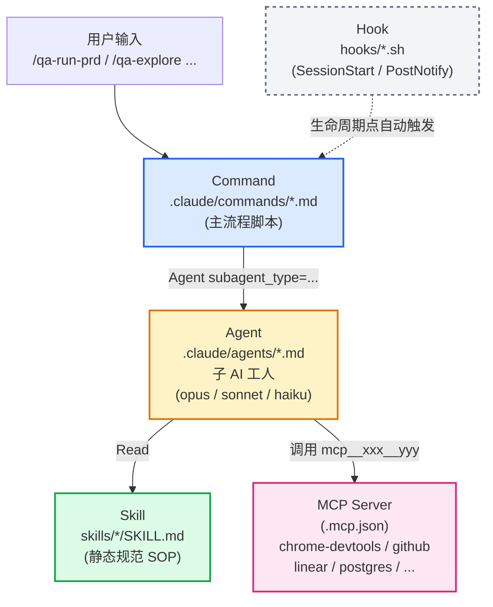
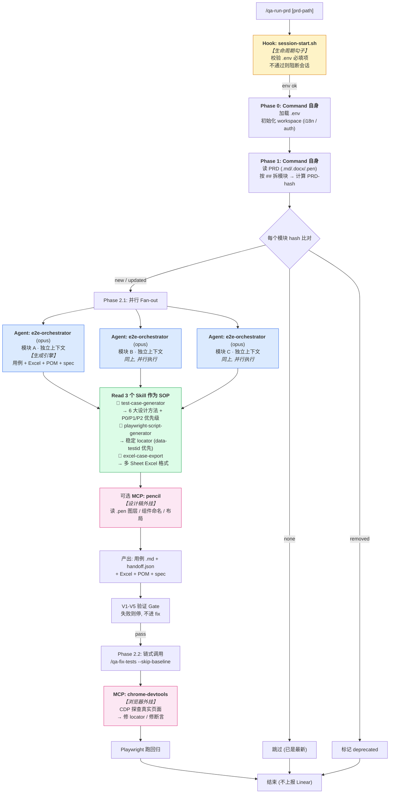
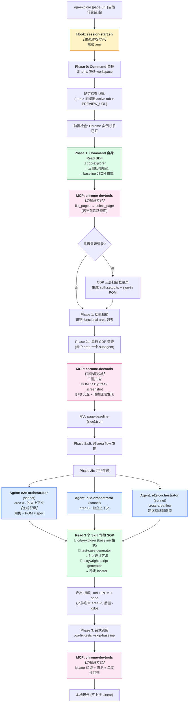
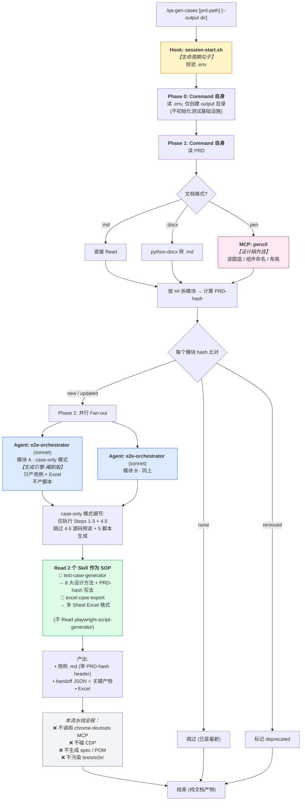

# QA 测试生成命令使用说明

## 命令速查表

> **⭐ 标记的是开发期最常用的 3 个核心 command**，新人优先掌握这 3 个；其它按场景查表即可。

| 分类 | Command | 描述 & 使用场景 & 注意点 & 涉及 Agent |
|---|---|---|
| ⭐ **开发期核心** | ⭐ **`/qa-run-prd`** | **描述**：PRD 驱动的端到端 E2E 流水线 —— 拆模块 → 生成用例/Excel/POM/spec → CDP 修 locator → 跑回归。<br>**使用场景**：新需求评审后落地、版本上线前完整自动化测试覆盖、PRD 改动后增量重跑。<br>**输入不止是 PRD markdown**：① `.md`/`.docx`（python-docx 自动转）；② **Pencil `.pen` UI 设计稿**（配 `mcp__pencil__*` MCP 后 orchestrator 自动读图层、组件命名、布局，把 UI 细节灌进用例和 locator hint）；③ Figma/其它设计源也可以挂自定义 MCP 让 agent 读取。<br>**涉及 Agent / Skill**：<br>• `e2e-orchestrator`（opus，按模块**并行**起多个 instance）—— 总控用例生成 + Excel + POM/spec 落地<br>• `test-case-generator` skill —— 应用 6 大设计方法（等价类/边界值/因果图/状态转换/场景法/错误推测）<br>• `playwright-script-generator` skill —— 源码 grep `data-testid`+aria 生成稳定 locator<br>• `excel-case-export` skill —— 多 Sheet Excel 汇总<br>• 链式调用 `/qa-fix-tests --skip-baseline` —— CDP 探查真实页面修正定位器和断言<br>**注意点**：① 自身**不**碰 CDP，所有真实页面验证都甩给 fix-tests；② 增量友好 —— PRD-hash 算法检测模块变更，hash 没变的模块跳过；③ 不上报 Linear（要汇报手动 `/qa-run`）；④ 生成阶段失败会卡在 V1-V5 验证关口，不会进 fix 阶段。 |
| 开发阶段验证 | `/qa-from-branch` | **描述**：从 GitHub 分支 vs main 的代码 diff 反向匹配已有 spec 或补生成缺失模块；区分"真回归" vs "断言过时" vs "pre-existing"，可选评论到 Linear。<br>**使用场景**：PR 预检、合并前回归、分支转测。<br>**涉及 Agent**：`e2e-orchestrator`（仅补 unmatched 模块）+ `cdp-test-executor`（CDP 直接跑 spec）+ `report-analyzer`（失败三分类）+ Linear MCP（可选）。 |
| ⭐ **开发期核心** | ⭐ **`/qa-explore`** | **描述**：浏览器实例已开 → CDP 三层扫描（DOM/accessibility tree/screenshot）产 baseline → 按 area 生成测试用例 + POM + Playwright 脚本。<br>**使用场景**：页面已上线但没用例（旧功能补测）、临时补 smoke 覆盖、对未文档化页面做"逆向"用例。<br>**额外能力**：可以叠 `.pen` 设计稿（pencil MCP）做"设计 vs 实现"对比生成，发现 UI 漂移；自然语言描述能补 PRD 没写的隐式行为（如"测一下下拉滚动加载"）。<br>**涉及 Agent / Skill**：<br>• `cdp-explorer` skill —— CDP 三层扫描，区分 user input / state change / cross-area flow<br>• `e2e-orchestrator`（sonnet，每个 area 一个**并行** instance）<br>• `test-case-generator` + `playwright-script-generator` skills<br>• 链式 `/qa-fix-tests --skip-baseline` —— locator 验证 + 回归<br>**注意点**：① **必须有 Chrome 已开实例**（chrome-devtools MCP 端口连接）；② 文件命名带 area-id（区别 PRD/issue 来源），如 `login-form-join-cdp.test.ts`；③ 不上报 Linear；④ 适合做"探查 + 一次性补 spec"，不适合做持续回归（用 `/qa-run`）。 |
| ⭐ **开发期核心** | ⭐ **`/qa-gen-cases`** | **描述**：仅从 PRD/设计稿生成测试用例 `.md` + handoff `.json` + Excel，**不**生成 Playwright 脚本、**不**执行。<br>**使用场景**：需求评审前先把 PRD 翻译成可读用例文档发给 QA 评审；后续真要跑再 `/qa-run-prd` 复用 handoff 直接出脚本（不重做用例生成）；适合"先评审用例再投入开发"的研发节奏。<br>**输入支持**：① `.md` PRD；② `.docx`（python-docx 自动转）；③ **`.pen` Pencil 设计稿**（pencil MCP 读取）；④ 多文件混合输入，让 orchestrator 同时吃 PRD 文字 + UI 设计图。<br>**涉及 Agent / Skill**：<br>• `e2e-orchestrator`（sonnet，**case-only 模式** —— 仅 Steps 1-3 + 4.5，跳过 4.6 源码预读和 5 脚本生成）<br>• `test-case-generator` skill —— 6 设计方法落地用例 + PRD-hash 写入 .md header<br>• `excel-case-export` skill —— 多 Sheet 汇总<br>**注意点**：① 不做任何 CDP / 源码 grep / Playwright 操作，纯文档处理；② **handoff JSON 是关键产物** —— 下次跑 `/qa-run-prd` 直接消费，跳过用例阶段；③ PRD-hash 变更检测同 run-prd，仅变化模块重跑；④ 不创建 spec/POM，不会污染 `tests/e2e/` 目录。 |
| Bug 验证 | `/qa-from-issue` | **描述**：从 Linear issue 抽取 `pageUrl/expectedBehavior/actualBehavior/reproSteps` 生成或更新 E2E，跑完追加结果回原 issue。<br>**使用场景**：bug 复盘 / 单点验证 / 上线后 issue 闭环。<br>**涉及 Agent**：`cdp-explorer`（按 pageUrl 分组**串行**） + `e2e-orchestrator`（并行） + `test-executor`（changed + smoke） + `report-analyzer` + `bug-reporter`（只 append 评论，不创建新 issue）。 |
| 回归 & 修复 | `/qa-run` | **描述**：直接执行已有 E2E（按 suite/lang/slug/source 过滤），聚合报告，分流失败 → Linear。<br>**使用场景**：周期回归、CI 跑全量、夜跑、release 前 final regression。<br>**涉及 Agent**：`test-executor` + `report-analyzer` + `bug-reporter`（Linear 自动建 / append issue）。 |
| 回归 & 修复 | `/qa-fix-tests` | **描述**：跑失败用例 → CDP 探查真实页面 → 修 locator/断言 → 单文件回归验证；区分"测试问题"和"应用 bug"，bug 不改测试。<br>**使用场景**：UI 改版后批量 locator 漂移、定期清理 flaky；可被 run-prd / explore / from-issue 链式调用，也能手动单跑。<br>**涉及 Agent**：fix subagent（CDP 探查 + Edit POM/spec） + `cdp-explorer` skill + `test-executor`（单文件） + `report-analyzer`。 |

---

## 0. 前置：环境变量（`.env`）

跑下面任何一个命令前，先把 `.env` 配好。

### 必需（缺一不可）

| 变量 | 说明 | 示例 |
|---|---|---|
| `QA_WORKSPACE_DIR` | QA 工作空间根目录，所有生成的 spec/POM/报告都写到这里（默认就好） | `./tests/e2e/local` |
| `SOURCE_PROJECT_DIR` | **被测项目源码目录**（mira 代码地址）。所有 agent Read 源码的根，**缺了 CDP 探查会退化、locator 不稳、Phase 0 源码预读直接跳过** | `D:\xxxx\xxxx\mira` |
| `PREVIEW_URL` | 被测环境地址，**baseURL 的唯一来源**（不要再单独配 `PLAYWRIGHT_BASE_URL`） | `https://mira-bff-preview.up.railway.app/` 或 `localhost:3000` |
| `E2E_TEST_EMAIL` | 测试账号邮箱。**所有登录态用例都要靠它**，缺了 `auth.setup.ts` 跑不起来，Playwright 一开始就会 fail | `qa@mira.local` |
| `E2E_TEST_PASSWORD` | 测试账号密码，配合上面那项使用 | `••••••` |

### 可选

| 变量 | 说明 |
|---|---|
| `PLAYWRIGHT_HEADLESS` | `true` / `false` |
| `SLACK_WEBHOOK_URL` | 失败告警推 Slack |
| `APP_LANGUAGES` | 多语言代码（如 `en,zh,fr`），不配就是单语言模式 |
| `I18N_MESSAGES_DIR` | i18n 字典源路径 |

### 三个命令的额外必需变量（按场景）

> 五项基础必需变量是所有命令共享的；下表只列额外要加的。

| 命令 | 额外必需 |
|---|---|
| `/qa-run-prd` | （无） |
| `/qa-from-issue` | `LINEAR_API_KEY` + `LINEAR_TEAM_ID` + `LINEAR_PROJECT_ID` |
| `/qa-from-branch` | `GITHUB_TOKEN` + `TARGET_GITHUB_OWNER/REPO`（要评论 Linear 时再加 LINEAR_*） |

> SessionStart hook (`hooks/session-start.sh`) 会自动校验上面这些变量，缺失时会提示。

---

## 1. `/qa-run-prd` — PRD 驱动

**用途**：从需求文档生成 E2E 测试并执行。
**用法**
```bash
/qa-run-prd                                 # 读默认 $SOURCE_PROJECT_DIR/docs/prd/
/qa-run-prd docs/prd/login-v2.md            # 指定 PRD
/qa-run-prd docs/prd/ --source ../my-app    # 指定源码目录
```
**执行步骤**
| Phase | 动作 |
|---|---|
| 0 | 加载 `.env`、初始化 workspace（i18n / auth 基础设施） |
| 1 | 读 PRD → 按 `##` 拆模块 → 用 PRD-hash 检测变更（`none`/`new`/`updated`/`removed`） |
| 2.1 | **并行**给每个变化模块跑 `e2e-orchestrator` → 用例 + Excel + POM + spec |
|     | 通过 `verification-gate V1-V5` 校验，失败则停 |
| 2.2 | 调 `/qa-fix-tests --skip-baseline` → CDP 探查真实页面 → 修 locator/断言 → 重跑通过 |
| -   | **不上报 Linear**（如需汇报，跑完后手动 `/qa-run`） |

**特点**：增量友好（hash 变了才重生成）；自身不碰 CDP，全部交给 fix-tests。

---

## 2. `/qa-from-issue` — Issue 驱动

**用途**：从 Linear issue 描述生成或更新 E2E，执行后回写结果到原 issue。
**用法**
```bash
/qa-from-issue STE-9                        # 单个
/qa-from-issue STE-9 STE-10 STE-11          # 批量
/qa-from-issue https://linear.app/.../STE-9 # URL
/qa-from-issue --all-open                   # 所有 Open/Backlog
/qa-from-issue --status backlog             # 按状态批量
/qa-from-issue "download format"            # 关键词搜索
/qa-from-issue STE-9 --source D:\my-project # 指定源码目录
```
**执行步骤**
| Phase | 动作 |
|---|---|
| 0   | 加载 `.env`、初始化 workspace |
| 1   | 取 issue 详情 → 提取 `pageUrl` / `expectedBehavior` / `actualBehavior` / `reproSteps` / `feature` |
|     | 查已有 spec（按 TC ID → 文件名 → pageUrl → 关键词），命中则走 `update`，否则 `create` |
| 2   | **串行** CDP 定向探查（按 pageUrl 分组，同页 issue 合并）→ 写 baseline |
| 3.1 | **并行** `e2e-orchestrator` → 用例 + POM + spec |
| 3.2 | `/qa-fix-tests --skip-baseline` → 修复 locator |
| 3.3 | `test-executor (changed+smoke)` → 跑变更 spec + 全局 @smoke 回归 |
| 3.4 | `report-analyzer` 分流失败 → `bug-reporter`（**仅 append 回写源 issue**，不创建新 issue） |
| -   | **上报 Linear** ✅ |

**特点**：会主动写回 Linear 。

---

## 3. `/qa-from-branch` — 代码变更驱动

**用途**：从 GitHub 分支 vs main 的 diff 出发，匹配已有 spec 或为缺失模块补 spec，执行并可选汇报。
**用法**
```bash
/qa-from-branch                                 # 交互式选分支（GraphQL 拉最近 5 个）
/qa-from-branch feature/chat-redesign           # 显式分支
/qa-from-branch feature/xyz STE-42 STE-43       # 分支 + 关联 issues
/qa-from-branch STE-42                          # 仅 issue（无分支模式）
/qa-from-branch feature/xyz --local             # 本地 git 代替远程 API
/qa-from-branch feature/xyz --source ../app     # 指定源码目录
```
**执行步骤**
| Phase | 动作 |
|---|---|
| 0   | 加载 `.env`、解析参数（branch / issueInputs / sourceOverride / forceLocal） |
| 1   | 选分支（GraphQL 列表 / 显式 / 无分支）→ 选 diff 策略（完整分支 / 最新 commit / 本地未提交）→ 拉 changelist + rawDiff → 生成 changeSummary → 读改动源码 |
| 1.5 | （可选）拉 Linear issue 上下文，合并 pageUrl + 模块关键词 |
| 2.1 | 扫已有 spec/POM，建立 slug → spec 索引 |
| 2.2 | **两遍匹配**：Pass 1 关键词出候选；Pass 2 拿 POM/handoff 的 selector 在 rawDiff 里搜，分类 `affected` / `maybe-affected` / `unmatched` |
| 2.3 | maybe-affected 询问用户跑不跑 |
| 2.4 | **断言影响分析**：检查已有 spec 的断言文案是否被 diff 删掉 → 标 `needs_assertion_review` |
|     | 决策：`selective` / `selective+generate` / `generate` / `skip` |
| 3   | （只对 unmatched 模块）推断 pageUrl → CDP 探查 → `e2e-orchestrator` 生成（带跨源 dedup）→ V1-V5 校验 → `/qa-fix-tests` 修复 |
| 4   | `cdp-test-executor` 执行 matched + new spec → `cdp-results.json` |
| 5   | `report-analyzer` 三分类失败：🔴 `regression_likely` / 🟡 `assertion_outdated` / ⚪ `pre_existing` |
|     | 有传 issue 时询问用户是否评论到 Linear（**只评论，不改状态**） |

**特点**：唯一能"代码 → 测试"反向匹配；区分真回归 vs 断言过时；Linear 汇报可选。

---

## 三者快速对比
| 维度 | `/qa-run-prd` | `/qa-from-issue` | `/qa-from-branch` |
|---|---|---|---|
| 输入 | PRD 文档 | Linear issue | 分支 diff (+ 可选 issue) |
| 增量识别 | PRD-hash | 已有 spec 匹配 | rawDiff selector 命中 |
| CDP 探查 | 不做（甩给 fix-tests） | 做（按 pageUrl 分组串行） | 仅对新模块做 |
| 执行器 | Playwright (经 fix-tests) | Playwright + smoke 回归 | **CDP executor**（cdp-results.json） |
| Linear | ❌ | ✅ append 写回源 issue | 可选评论（用户确认） |
| 主用场景 | 新需求落地 | bug 复盘 / 单点验证 | PR/分支预检、回归 |

---

# 第二部分：Agent / Skill / Hook / MCP 核心概念

> 上面讲的是"开车要按哪个按钮"（command）；这一节讲"按下按钮后引擎里发生了什么"。<br>
> 顺序记：**Command 是入口，Agent 是工人，Skill 是 SOP 手册，MCP 是外挂工具，Hook 是生命周期勾子。**

## 4. Agent — "被 command 调起来干活的子 AI"

**定义**：`.claude/agents/*.md` 下的一个文件就是一个 agent。每个 agent 是一个**独立 AI 子进程**，有自己的角色、自己的工具白名单、自己的模型档位。Command 是"主流程脚本"，agent 是"被它调用的工人"。

**速查表**（本项目 9 个 agent）

| Agent | 模型 | 角色 | 谁调它 |
|---|---|---|---|
| `e2e-orchestrator` | opus | **生成引擎**：用例 + Excel + POM + spec | qa-run-prd / qa-explore / qa-from-issue / qa-from-branch / qa-gen-cases |
| `test-executor` | haiku | 执行已有 spec，输出报告 | qa-run / qa-from-issue |
| `cdp-test-executor` | sonnet | CDP 直接驱动跑 spec（更稳） | qa-from-branch |
| `report-analyzer` | sonnet | 分析报告，去重，分类失败 | 所有跑测后 |
| `bug-reporter` | sonnet | 创建/追加 Linear issue | qa-run / qa-from-issue |
| `api-orchestrator` | sonnet | API 测试生成（基于 Schema） | qa-api-test |
| `unit-test-agent` | opus | 增量单元测试生成 | qa-unit-test |
| `eval-agent` | sonnet | Langfuse trace → eval dataset | qa-eval |
| `sentinel-agent` | haiku | 多平台质量监控守护 | qa-sentinel |

**关键认知**
- Agent **不会自启动**，必须 command 用 `Agent(subagent_type=..., prompt=...)` 调起来
- 每个 agent **独立上下文**，跨 agent 不共享记忆，所有信息靠 prompt 传
- 模型分档：opus 干总控/复杂判断、sonnet 干分析/生成、haiku 干纯执行/聚合
- 多个 agent 可以**并行**起（如 PRD 5 个模块 → 5 个 e2e-orchestrator 同时跑）

## 5. Skill — "静态 SOP 手册，没有运行实例"

**定义**：`skills/<name>/SKILL.md` 是一份**纯文档规范**，没有进程、没有自己的模型。Agent 在执行某一步前**先 Read SKILL.md**，按照里面写的算法、字段、模板产出结果。

**速查表**（本项目 10 个 skill）

| Skill | 用途 | 被谁 Read |
|---|---|---|
| `cdp-explorer` | CDP 三层扫描规范（DOM / a11y / screenshot），baseline JSON 格式 | qa-explore command + e2e-orchestrator |
| `test-case-generator` | 6 大设计方法、P0/P1/P2 优先级、PRD-hash 写法 | e2e-orchestrator |
| `playwright-script-generator` | locator 优先级（data-testid > role > text）、POM 模板 | e2e-orchestrator |
| `excel-case-export` | 多 Sheet 用例 Excel 格式 | e2e-orchestrator |
| `test-data-setup` | 前置数据（账号/工作区/任务）的准备脚本 | test-executor |
| `unit-test-generator` | Vitest/pytest 增量单测规范 | unit-test-agent |
| `api-test-generator` | OpenAPI/Schema → API 测试 | api-orchestrator |
| `perf-test-generator` | k6 性能脚本 + 基线对比 | (perf 流水线) |
| `llm-eval-builder` | LLM-as-Judge 评估 dataset 构造 | eval-agent |
| `mock-config-generator` | MSW mock 配置 L1/L2/L3 | api-orchestrator |

**关键认知**
- Skill **不是 agent**：没有 frontmatter 里的 `model`、没有 `tools` 限制，纯 markdown
- Skill 是 **single source of truth**：同一个规范（如 locator 优先级）只在 skill 里写一次，所有 agent 引用同一份
- 用户也能直接 `Skill(skill="...")` 调起，但本项目主要是 agent 内部使用
- 类比：command 是"出差任务单"，agent 是"出差的人"，skill 是"公司报销 SOP 手册"

## 6. Hook — "Claude Code 会话生命周期里的脚本勾子"

**定义**：`hooks/*.sh` 是**纯 shell 脚本**，不是 AI、不靠模型，由 Claude Code harness 在特定事件触发时自动跑，输出 JSON 给主进程，会话才继续。

**速查表**（本项目 2 个 hook）

| Hook | 触发时机 | 干什么 |
|---|---|---|
| `session-start.sh` | 每次 Claude Code 会话启动 | 校验 `.env` 必填项（`PREVIEW_URL` / `GITHUB_TOKEN` / `LINEAR_API_KEY` / `QA_WORKSPACE_DIR`），缺失则返回 `{"error":"..."}` 阻断 |
| `post-notify.sh` | 事件完成后 | 推 Slack / 桌面通知（可选） |

**关键认知**
- Hook **不被 command 调用**，是 harness 在生命周期点位（SessionStart / Stop / PreToolUse / PostToolUse 等）自动执行
- Hook 是"系统级守门员"，用来做**强制校验**（环境变量没配齐就不让你跑）
- 配置在 `settings.json` / `settings.local.json` 里，本项目主要靠 SessionStart 把 `.env` 校验前置
- 不要把"业务逻辑"放在 hook 里——hook 适合做校验、通知，不适合做生成或决策

## 7. MCP — "外挂工具协议，把外部系统接到 Claude 里"

**定义**：MCP (Model Context Protocol) 是 Anthropic 的协议标准。`.mcp.json` 里声明一个 server，启动后这个 server 暴露的工具就以 `mcp__<server-name>__<tool-name>` 形式出现在 agent/command 可调用列表里。

**速查表**（本项目 8 个 MCP server）

| MCP Server | 干什么 | 主要用在哪个 command |
|---|---|---|
| `chrome-devtools` | CDP 操控浏览器：click / fill / snapshot / screenshot / navigate | qa-explore、qa-fix-tests、cdp-test-executor、i18n-cdp-runner |
| `github` | GitHub API：拉 branch diff / PR / commit | qa-from-branch |
| `pencil` | 读 `.pen` UI 设计稿图层、组件命名、布局 | qa-run-prd、qa-gen-cases（设计稿模式） |
| `postgres` | 直连 Mira 数据库（前置数据、监控） | test-data-setup、sentinel-agent |
| `e2b` | 云端沙箱执行（隔离跑测） | (CI 流水线可用) |
| `sentry` | 拉 Sentry 错误 | sentinel-agent |
| `linear` | Linear issue 增删查改 | qa-from-issue、qa-from-branch、bug-reporter |
| `stripe` | Stripe 测试账号/支付 | (支付相关 e2e) |

**关键认知**
- MCP 工具命名一律 `mcp__<server>__<tool>`，可在 agent frontmatter 的 `tools:` 字段白名单里精确控制
- **Chrome DevTools MCP 是本项目的灵魂** —— 所有 CDP 探查、locator 验证、真实页面跑测都靠它
- MCP server 是**外部进程**，配置在 `.mcp.json`，靠 `npx` / 本地可执行启动，agent 通过 stdio 通信
- 不要把 MCP 当成"内置工具"——它需要在 `.mcp.json` 启动、需要凭证、可能要走代理（本项目 GitHub/Linear/Sentry 都配了 `HTTPS_PROXY`）

---

## 8. Command vs Agent vs Skill — 区别与适用场景

> 三者长得都像 markdown 文件，新人最容易混。一句话区分：<br>
> **Command 是入口；Agent 是工人；Skill 是手册。**

### 8.1 三者本质对比

| 维度 | Command | Agent | Skill |
|---|---|---|---|
| **文件位置** | `.claude/commands/*.md` | `.claude/agents/*.md` | `skills/*/SKILL.md` |
| **谁触发它** | 用户在命令行输入 `/xxx` | Command 通过 `Agent(subagent_type=...)` 调起 | Agent / Command 主动 `Read` 它 |
| **有自己的模型吗** | ❌ 跑在主对话里（用主 Claude） | ✅ 自己的模型档位 (opus / sonnet / haiku) | ❌ 纯文档，没有模型 |
| **独立上下文** | ❌ 共用主对话 | ✅ 完全独立，跑完只返摘要 | ❌ 没有上下文 |
| **可见性** | 用户直接看到执行过程 | 后台执行，用户只看摘要 | 用户一般不直接看 |
| **能调外部工具** | ✅ 可以调 MCP / Read skills / 调 Agent | ✅ 可以调 MCP / Read skills | ❌ 不调任何东西 |
| **能并行吗** | ❌ 单个命令是串行流程 | ✅ 可以同时起 N 个 instance | ❌ 静态文档 |
| **典型用途** | 给用户一个"一键按钮" | 模块化分工、并行、隔离上下文、按需选模型 | 沉淀可复用的规范 / 算法 / 模板 |

### 8.2 什么时候用什么

| 场景 | 选哪个 | 为什么 |
|---|---|---|
| 想给用户提供"一键跑通"的入口 | **Command** | 用户只记 `/qa-run-prd`，不用关心内部多少子任务 |
| 同一条流水线要并行处理多个独立模块 | **Agent** | 每个 agent 有自己上下文，互不污染；可以同时起 N 个 |
| 单步任务巨大，怕把主对话 context 撑爆 | **Agent** | 子上下文跑完只返摘要，主对话保持干净 |
| 任务复杂度差异大（重 / 中 / 轻） | **Agent** | 按需选 opus / sonnet / haiku，省钱又快 |
| 多个 agent 要遵守同一份规范（如 locator 优先级） | **Skill** | 写一次，N 个 agent Read 同一份，改一处全员同步 |
| 算法 / 模板 / JSON 字段定义这类细则 | **Skill** | agent 系统提示要精简，复杂细则下沉到 skill |
| 强制做"会话生命周期校验"（如 `.env` 必填） | **Hook**（独立概念） | 不是 AI 任务，纯脚本由 harness 自动触发 |
| 接外部系统（浏览器 / DB / Linear / GitHub） | **MCP**（独立概念） | 外部能力通过 MCP 协议接到 Claude |

### 8.3 一条经验法则

> **同一段逻辑被 ≥ 2 个 agent 用到 → 抽成 skill。**<br>
> **一个 command 里需要并行 / 隔离上下文 / 切模型 → 拆成 agent。**<br>
> **想让用户在命令行直接调起 → 暴露成 command。**

**本项目的典型三层分工链**：

```
用户输入 /qa-run-prd
     ↓ Command 解析参数、拆 PRD 模块
   起 N 个 Agent (e2e-orchestrator) 并行执行
     ↓ 每个 Agent Read 3 个 Skill 作为 SOP 规范
   产出可跑的 spec → 链式调用 /qa-fix-tests
```

- `e2e-orchestrator` 这个 agent **被 5 个 command 复用**（qa-run-prd / qa-explore / qa-from-issue / qa-from-branch / qa-gen-cases）→ 适合抽成 agent
- `test-case-generator` 这个 skill **被多个 agent Read**（e2e-orchestrator / unit-test-agent 等）→ 适合抽成 skill
- `/qa-run-prd` 用户直接喊 → 暴露成 command

---

## 9. 四者关系一图流



---

# 第三部分：三个 Command 的真实执行流程图（带 Agent / Skill 注释）

> 把上面的 Command / Agent / Skill / MCP / Hook 串联起来——看每个 command 实际触发了哪些组件，**每个 agent / skill 节点都附带它的作用**。

## 10.1 ⭐ `/qa-run-prd` 执行流程



**串联说明（结合上面的概念）**：
- 🟡 `Hook` 在会话启动时就跑了，把守入口（环境变量没配齐直接拦下）
- 🔵 `Command` 自身只做"拆模块 + 决定调谁"，**不碰 CDP**
- 🔵 `Agent` (e2e-orchestrator) 起 N 个 **并行实例**，每个独立上下文，跑同一段流程但负责不同 PRD 模块
- 🟢 每个 Agent 先 `Read` 三个 `Skill` 作为 SOP 规范（不要把这些规范写进 agent 提示里）
- 🟣 最后链式调 `/qa-fix-tests`，由它去用 `MCP: chrome-devtools` 摸真实页面

---

## 10.2 ⭐ `/qa-explore` 执行流程



**串联说明（结合上面的概念）**：
- 与 `/qa-run-prd` 最大不同：🔵 **Command 自己直接调 🟣 MCP** 跑 CDP 探查，不甩给 fix-tests
- 🟢 `cdp-explorer` Skill 是 baseline JSON 格式的 **single source of truth**，被 Command + Agent 多处 Read
- 🔵 Agent 并行的粒度是"area"（一个页面里的一块功能区域），而不是 PRD 模块
- 🟣 chrome-devtools MCP 在这条流水线里出现 **三次**：选页 / 探查 / 修复

---

## 10.3 ⭐ `/qa-gen-cases` 执行流程



**串联说明（结合上面的概念）**：
- **最轻量的一条流水线**：只有 🟡 Hook + 🔵 Command + 🔵 Agent + 🟢 Skill，**完全不用 🟣 MCP**（除非 .pen 设计稿用 pencil）
- 🔵 Agent 用的是 e2e-orchestrator 的 **case-only 子模式**：跳过 Steps 4.6 和 5（不读源码、不生成脚本）—— 同一个 agent 通过 prompt 参数变体复用
- 🟢 只 Read 2 个 Skill（不需要 playwright-script-generator）
- 关键产物是 `handoff JSON`：未来跑 `/qa-run-prd` 时直接消费这个 JSON 跳过用例生成阶段，**节省一大段工作**
- 适合"用例先评审再开发"节奏，是 `/qa-run-prd` 的可选前置

---

## 三个流程的核心差异

| 维度 | ⭐ `/qa-run-prd` | ⭐ `/qa-explore` | ⭐ `/qa-gen-cases` |
|---|---|---|---|
| **Command 自己碰 CDP 吗** | ❌ 完全不碰 | ✅ 直接调 chrome-devtools MCP | ❌ 完全不碰 |
| **MCP 使用** | 仅可选 pencil | chrome-devtools (核心) + 可选 pencil | 仅可选 pencil |
| **Agent 数量** | N 个 PRD 模块 → N 个 e2e-orchestrator | N 个 area → N 个 e2e-orchestrator | N 个 PRD 模块 → N 个 e2e-orchestrator |
| **Agent 模型档** | opus (总控复杂) | sonnet (区域分析) | sonnet (纯文档) |
| **Agent 模式** | 完整模式 | 完整模式 | **case-only 模式**（跳过脚本生成） |
| **Read 哪些 Skill** | test-case-gen + excel + playwright-script | cdp-explorer + test-case-gen + playwright-script | test-case-gen + excel（**少一个**） |
| **是否链式 fix-tests** | ✅ 强制 | ✅ 强制 | ❌ 不跑 |
| **最终产物** | 可跑的 spec + 回归报告 | 可跑的 spec + 回归报告 | 纯用例 .md + handoff.json + Excel |
| **Hook** | session-start 校验 .env | session-start 校验 .env | session-start 校验 .env |
